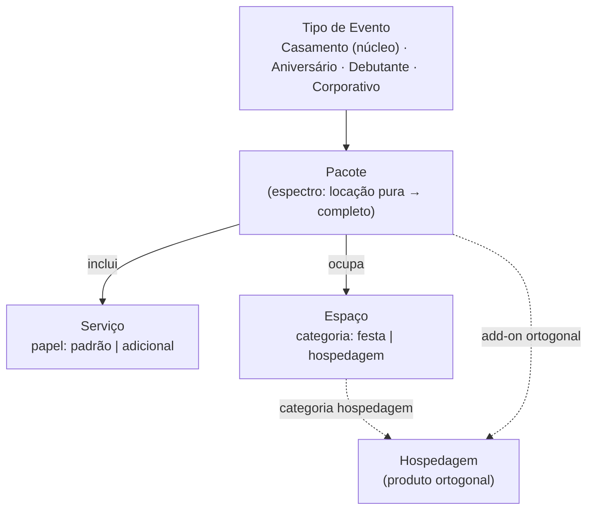

# 01 · Modelo de Domínio

**Status:** v1 final (perguntas de validação resolvidas) · **Camada de tom:** trabalho · **Depende de:** —
**Responsabilidade única:** a verdade do negócio — entidades e atributos, tech-neutral. É a fonte do registro de Assuntos da plataforma (02) e do vocabulário de domínio (00 §5).

> **Origem:** derivado da descrição direta do negócio pelo fundador (clean-room) e validado em ciclo de perguntas. Artefatos anteriores (Contexto VVF, mapas de growth) entram só na reconciliação (§6).

---

## 1. O negócio em uma linha

Empresa de **casamentos premium** no interior paulista, vendendo **pacotes completos de evento** (a quase totalidade das vendas) em espaços próprios, com hospedagem como produto ortogonal.

---

## 2. A camada estrutural (validada)

**`Tipo de Evento` ▸ realizado via `Pacote` ▸ composto de `Serviços` ▸ sediado em `Espaço`.**

Na linguagem da metodologia interna, é uma **camada estrutural cross-domain (Type B)** acima dos domínios de serviço individuais (Buffet, Decoração, Cerimonial, …). Registrada como input para um futuro Domain Map.

---

## 3. Entidades

### 3.1 `Tipo de Evento` — registro ativo
A natureza da celebração. **Todos vendáveis hoje**, tratados igualmente pelo modelo; Casamento é o núcleo comercial (~totalidade das vendas).
Instâncias: **Casamento** · **Aniversário** · **Debutante** · **Corporativo** *(outros, raríssimos, entram por dado)*.
**Decisão (validada):** a "verticalização" (VVXV/VVCorp — §6 do Contexto) é conceito **organizacional** (equipe/processos dedicados, futuro, atrás de gate). Comercialmente, qualquer tipo de evento é vendável desde já — o registro é ativo, não reservado.

### 3.2 `Espaço`
Local físico. Atributo **`categoria: festa | hospedagem`** (validado — cobre os 5):
- `festa`: **Acqua**, **Florest**, **Serra**
- `hospedagem`: **Morada do Vale**, **Villa do Vale**
Atributos de conteúdo (para a plataforma): galeria, vídeo-tour, localização, capacidade, descrição.

### 3.3 `Pacote`
O que se vende. Espectro: **locação pura** (extremamente rara) → **pacote completo** (quase totalidade), com serviços padrão + adicionais opcionais.
**Decisão (validada):** "Autoral" **não existe** como nível de pacote. Festas totalmente customizadas são um **formato excepcional** que pode ser trabalhado (inclusive como campanha de marketing — ver 02 §6), mas não integra a estrutura de Pacote. Coerente com INV-07 (customização total é exceção, não norma).

### 3.4 `Serviço`
Componente entregue dentro do pacote. Atributo **`papel: padrão | adicional`** (terminologia validada; valores extensíveis por dado se surgir categoria real):
- `padrão` (compõe o pacote): **Assessoria Cerimonial do Dia**, **Planejamento do Evento**, **Buffet**, **Decoração**, **Som e Iluminação**
- `adicional` (opcional): **Bartender**, **Cerveja**, **Chope**, **Entretenimento** (painel de LED, kombi fotográfica, …)
**Decisão (validada):** `papel` é atributo **do Serviço** (papel típico). A relação Pacote×Serviço não é modelada na plataforma — Pacote é estrutura de oferta do domínio, não entidade do site. Finalidade do `papel` na plataforma: ângulo de copy ("já incluído e excelente" vs. "eleve a experiência") e etiquetagem de interesse que conversa com o KPI de upgrade (M-02) — a medição do upgrade em si acontece no comercial/Kommo.
Nota de ownership: serviços como Buffet/Decoração coincidem com domínios do negócio; o domínio é o dono canônico, o `Serviço` aqui é sua representação na camada de composição/venda.

### 3.5 `Hospedagem`
Produto ligado aos Espaços de categoria `hospedagem`. **Ortogonal** ao espectro do pacote — add-on/produto à parte, normalmente fechado na assinatura do contrato (Contexto §3.4).

---

## 4. Mapeamento para o registro de Assuntos (02)

| TipoDeAssunto | Atributo do domínio | Instâncias iniciais |
|---|---|---|
| `espaço` | `categoria: festa \| hospedagem` | Acqua, Florest, Serra, Morada do Vale, Villa do Vale |
| `serviço` | `papel: padrão \| adicional` | Assessoria Cerimonial, Planejamento, Buffet, Decoração, Som e Iluminação, Bartender, Cerveja, Chope, Entretenimento |
| `campanha` | `período` + `relacionados[]` (refs a espaço/serviço) | Campanha do Mês, Retrofit, "Festas totalmente customizadas" |

**Não viram TipoDeAssunto:** `Pacote` (estrutura de oferta — informa copy, não é foco de página) e `Tipo de Evento` (dimensão própria, referenciável por LPs/leads — ver 02 §7).

---

## 5. Lacunas conhecidas (não bloqueiam a plataforma)

Ciclo de vida das entidades, regras de negócio numeradas, atores/responsabilidades e ownership canônico fino seguem não mapeados — são escopo de Business Docs formais (business-mapper) e Domain Map (domain-architect), quando rodados. A camada do §2 fica registrada como input.

---

## 6. Reconciliação com artefatos anteriores

| Este doc | Contexto VVF | Resolução |
|---|---|---|
| `padrão` + `adicionais` | Essential → Inspiração (§3.4) | correspondem: padrão ≙ Essential · +adicionais ≙ Inspiração ✓ |
| Autoral fora do espectro de Pacote | Autoral como nível esporádico (§3.4) | **este doc prevalece:** Autoral = formato excepcional/campanha, não nível de produto |
| Tipo de Evento ativo (todos vendáveis) | VVXV/VVCorp atrás de gate (§6) | compatível: gate é organizacional (equipe/processos/voz própria); venda avulsa é permitida hoje |
| Hospedagem ortogonal | idem (§3.4) | consistente ✓ |

---

## 7. Validação contra invariantes VVF

- **INV-07:** customização total como exceção — refletido na decisão do Autoral ✓
- **INV-03:** serviços são componentes da experiência completa; o domínio não posiciona componente isolado ✓
- **§6 (foco não se dilui):** verticais seguem organizacionais e atrás de gate; o registro ativo de Tipo de Evento não antecipa vertical ✓
