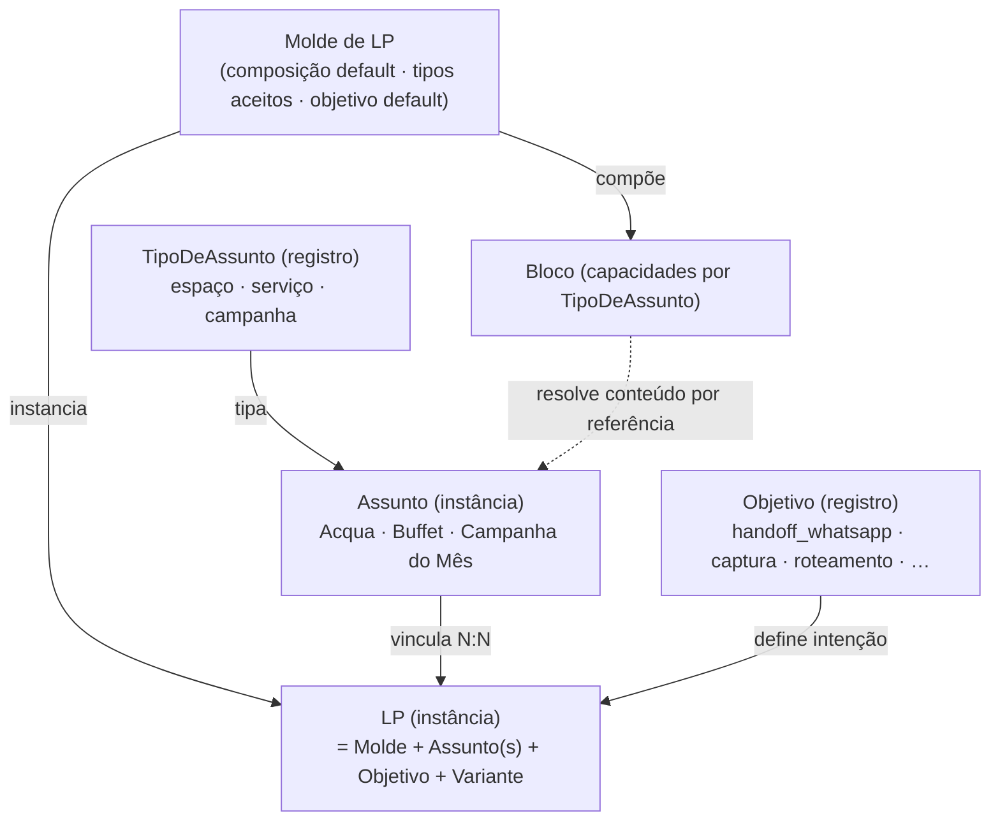

# 02 · Fundação da Plataforma

**Status:** v2 (rename aplicado + refinos do domínio + emenda Payload) · **Camada de tom:** trabalho · **Depende de:** 01
**Responsabilidade única:** as primitivas abstratas das quais todo o concreto deriva — **Molde · Assunto · Objetivo · Bloco · LP**. O sistema é agnóstico a formas de negócio: formatos nascem e morrem por **dados**, não por código.

> **Vocabulário (00 §5):** *Molde de LP* (antes "Arquétipo" — termo agora exclusivo da marca: Herói/Cuidador/Romântico) e *Assunto* (antes "Foco"). Os termos antigos são proibidos.

---

## 0. TL;DR

Existe **um** modelo abstrato; tudo que é executado é uma **derivação** dele. Uma LP é uma instância de um **Molde**, vinculada a um ou mais **Assuntos**, perseguindo um **Objetivo**. O *tipo* do Assunto (espaço, serviço, campanha) é **registro de dados**, não enum de código. "LP Acqua", "LP Gastronomia" e "LP Campanha do Mês" são a mesma máquina apontando para Assuntos de tipos diferentes.

---

## 1. Princípio da agnosticidade

1. **Zero business-concreto no código.** Espaços, serviços, campanhas, moldes, objetivos — instâncias de primitivas, vivendo como dados/config.
2. **Tudo que existe hoje é instância, não classe.** "Florest", "Buffet", "Retrofit" são linhas em tabela.
3. **Adicionar/descontinuar é operação de dado** (com a exceção declarada em §2.2 sobre *tipos*).
4. **Blocos e motores conhecem tipos e capacidades, nunca instâncias.**
5. **A indireção é o produto** — é o que mantém o sistema vivo enquanto o negócio muda.

---

## 2. As primitivas

### 2.1 `Molde de LP`
Esqueleto reaproveitável de uma família de páginas: composição default de Blocos + quais TiposDeAssunto aceita + Objetivo default. É config. Ex.: "Molde de Conversão", "Molde de Campanha", "Bio Page".

### 2.2 `TipoDeAssunto` — registro extensível
O registro de **tipos** de coisa-sobre-a-qual-uma-LP-fala. Cada tipo carrega um **schema de conteúdo**.

**Registro inicial (do 01):**

| TipoDeAssunto | Schema de conteúdo (campos comuns `nome/slug/status/seo` omitidos) | Instâncias |
|---|---|---|
| `espaço` | `categoria: festa\|hospedagem` · galeria[] · vídeo-tour · localização · capacidade · descrição | Acqua, Florest, Serra, Morada do Vale, Villa do Vale |
| `serviço` | `papel: padrão\|adicional` · descrição · galeria[]/moodboard · escopo | Assessoria Cerimonial, Planejamento, Buffet, Decoração, Som e Iluminação, Bartender, Cerveja, Chope, Entretenimento |
| `campanha` | `período{início,fim}` · tese/conceito · mídia[] · narrativa-de-oferta (sem preço — INV-05) · `relacionados[]` (refs a espaço/serviço) | Campanha do Mês, Retrofit (→ Florest), "Festas totalmente customizadas" |

**Emenda (decisão Payload — 00 §6):** *instâncias* de Assunto são dados (criar "Acqua" = admin, sem deploy ✓). **Criar um `TipoDeAssunto` novo = mudança de código** (nova collection/schema no Payload) — evento raro, PR pequeno, aceito como trade-off pela tipagem forte e pelo admin pronto. O princípio de agnosticidade vale integralmente para instâncias; para tipos, vale com deploy barato.

### 2.3 `Assunto`
Instância de um TipoDeAssunto. **Acqua** (espaço), **Gastronomia/Buffet** (serviço), **Campanha do Mês** (campanha). Carrega conteúdo conforme o schema do tipo + `status` de ciclo de vida.

### 2.4 `Objetivo de conversão` — registro extensível
A intenção da LP: `handoff_whatsapp` · `captura_lead` · `roteamento` (Bio Page) · `contato_qualificado` · `agendar_visita` *(planejado — D-13; o funil M-04 é centrado em visita)* · … Desacoplado do Assunto.

### 2.5 `Bloco`
Componente que resolve conteúdo **por referência** ao(s) Assunto(s) vinculado(s). Declara **capacidades** (de quais tipos extrai o quê). Nunca tem `switch` por instância. Degrada graciosamente quando o Assunto não tem a capacidade (§4).

### 2.6 `LP`
`LP = Molde + Assunto(s) + Objetivo + Variante(A/B) + overrides`. Vínculo com Assunto é **N:N** (ex.: Acqua + Gastronomia).

---

## 3. O modelo

---

## 4. Resolução de conteúdo (Bloco ↔ Assunto)

- Bloco *Galeria* → "a galeria do Assunto vinculado" → qualquer Assunto cujo tipo tenha `galeria` responde.
- Bloco *Período* → só `campanha` tem `período`; em outro tipo o bloco **não se renderiza** (degradação graciosa).
- **Overrides:** a LP pode sobrescrever um slot no admin sem alterar o Assunto.
- Regra dura: **bloco conhece capacidade, não instância.**

---

## 5. Ciclo de vida (sem deploy)

`status: ativo · descontinuado · arquivado` em Assunto, Molde e Objetivo.
- **Adicionar Assunto:** criar a linha no admin.
- **Descontinuar Assunto:** LPs vinculadas entram em despublish ou `301` para substituta definida no admin. Nunca página órfã indexada.
- **Campanhas** expiram sozinhas pelo `período`.
- **TipoDeAssunto:** descontinuar só sem Assuntos ativos; criar = código (§2.2).

Materializa INV-09 (replicável entre unidades) e §6 do Contexto (crescer/encolher por dados).

---

## 6. Derivações (exemplos)

| LP | Molde | Assunto(s) | Tipo | Objetivo | Nota |
|---|---|---|---|---|---|
| LP Acqua | Conversão | Acqua | espaço | handoff_whatsapp | herda conteúdo do espaço |
| LP Gastronomia | Conversão | Buffet/Gastronomia | serviço | handoff_whatsapp | INV-03: serviço é porta, experiência é o produto |
| LP Campanha do Mês | Campanha | Campanha do Mês | campanha | handoff_whatsapp | expira pelo período |
| LP Retrofit | Campanha | Retrofit (→ ref Florest) | campanha | handoff_whatsapp | campanha referencia espaço |
| LP "Festas customizadas" | Campanha | Festas customizadas | campanha | handoff_whatsapp | vende o Autoral como exceção (INV-07: sob medida raro/exclusivo, nunca "customização ilimitada como padrão") |
| LP Assessores | Conversão | institucional/serviço | serviço/espaço | contato_qualificado | segmentada por `origin_channel: assessor` (sem tipo `público`) |
| LP Acqua + Gastronomia | Conversão | Acqua, Buffet | espaço + serviço | handoff_whatsapp | vínculo N:N |

Nenhuma linha exige código novo (dado o registro de tipos existente).

---

## 7. Dimensões transversais (não são Assuntos)

- **`Tipo de Evento`** (01 §3.1): registro ativo (Casamento · Aniversário · Debutante · Corporativo), **referenciável** por LP e lead (`event_type`) para segmentação e atribuição — mas não é o "sobre o quê" da página.
- **`brand`** (default `VVF`): prontidão multi-vertical (§6 do Contexto) — dimensão presente no modelo, nada ativado antes dos gates.
- **`Pacote`** (01 §3.3): estrutura de oferta; informa copy, não vira entidade da plataforma.

---

## 8. Generalização

O mesmo princípio vale fora das LPs: categorias/clusters do blog são dados (07); objetivos e canais entram por registro; verticais futuras são dado + gate, não refactor.

---

## 9. Fonte de verdade com o domínio

O registro de Assuntos **espelha o 01** — "Buffet" na plataforma é a representação do domínio Buffet, nunca uma definição paralela. Divergência de vocabulário = defeito (00 §3).

---

## 10. Riscos & guardrails

| Risco | Guardrail |
|---|---|
| Over-abstração (sopa genérica) | TipoDeAssunto novo só com schema + comportamento distintos |
| Bloco renderizar capacidade ausente | capacidades declaradas + degradação graciosa + validação no admin |
| Indireção atrasar entrega | 3 tipos reais; crescer sob demanda |
| Divergência com o domínio | espelho do 01 (§9) |
| Assunto descontinuado virar página órfã | despublish/redirect no ciclo de vida (§5) |

---

## 11. Validação contra invariantes VVF

- **Tom:** doc = trabalho ✓ · copy derivado = marca ✓
- **INV-03:** Assuntos `serviço` são porta de entrada; a LP vende a experiência completa ✓
- **INV-07:** customização total vendida só como campanha de exceção ✓
- **INV-09:** replicação por dados ✓
- **§6:** verticais como dimensão atrás de gate; nada hardcoded ✓
