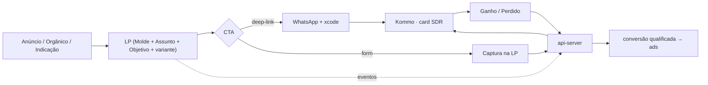

# 04 · Landing Pages & Conversão

**Status:** v2 (consome a Fundação; vocabulário novo) · **Camada de tom:** trabalho · **Depende de:** 01, 02, 03
**Responsabilidade única:** como LPs convertem — biblioteca de Blocos, caminho de conversão, contrato de lead → Kommo, propagação de origem e aplicação de marca. O **modelo** de LP (Molde/Assunto/Objetivo) é do 02; o A/B é do 08; o pipeline de eventos é do 05; a edição é no 06.

> **Tom:** spec = trabalho. **Todo copy de LP é tom de marca** (§4 do Contexto). Exemplos aqui são ilustrativos.

---

## 0. TL;DR

A LP é um **tradutor de intenção**: pega a intenção do canal de origem e a converte num **card rastreado no Kommo**, geralmente via handoff WhatsApp a um SDR. A LP entrega o lead com origem; **conversa, cadência e qualificação são do Kommo**. Toda LP é uma derivação `Molde + Assunto(s) + Objetivo + Variante` (02 §6) — nada de tipos de LP hardcoded.

---

## 1. Papel no ecossistema



---

## 2. Princípios

1. **LP traduz intenção, não vende componente** (INV-03): Assunto `serviço` é porta de entrada; o produto é a experiência completa.
2. **Mobile-first** — tráfego pago/Instagram é majoritariamente mobile.
3. **Conversão = card no Kommo.** Métrica é `lead`/handoff (idealmente `lead_qualificado` do loop fechado), nunca clique.
4. **Origem viaja sempre** — `xcode`/UTM da URL até o card (§6).
5. **Block-based, editável no 06** — LP é dado.
6. **Performance é gate** — orçamento de CWV do 03 vale por LP; fora do orçamento, não publica.

---

## 3. Catálogo de derivações (exemplos vivos — não são tipos)

Instâncias correntes do modelo do 02 §6: LP por espaço (Acqua/Florest/Serra) · LP por serviço (Gastronomia, vendendo a experiência) · LP de campanha (**Retrofit** — prioridade 1, campanha viva; Campanha do Mês; "Festas totalmente customizadas") · LP de hospedagem (Morada/Villa) · **Bio Page** por perfil de Instagram (Objetivo `roteamento`, ultraleve, `noindex`) · **LP Assessores** (Objetivo `contato_qualificado`, segmentada por `origin_channel: assessor` — canal de alto ticket, roteia a closer, não a SDR de massa).

---

## 4. Biblioteca de Blocos (núcleo)

Cada Bloco declara capacidades por TipoDeAssunto (02 §4) e carrega seu guardrail de marca:

- **Hero** — imagem colorida sangrada, headline Playfair, CTA primário. *Sem preço/promo (INV-05).*
- **Experiência Integrada** — a jornada end-to-end (planejamento → execução → pós). *Encarna INV-03.*
- **Galeria** — capacidade `galeria[]` (espaço/serviço/campanha). Só imagens próprias; sem filtro artificial (§5 do Contexto).
- **Prova Social / Depoimentos** — histórias de casais. *Tom sereno, segunda pessoa.*
- **Diferenciais** — ancorado nos 4 de §9 do Contexto + "sem surpresas". *INV-04: confiabilidade de frente sem soar operacional.*
- **Vídeo** — embed leve, lazy.
- **Moodboard/Decoração** — *INV-07: exclusividade pela história, dentro de um repertório de excelência; nunca "customização ilimitada".*
- **História & Exclusividade** — narrativo; vende o único pela história do casal.
- **Período da Campanha** — capacidade exclusiva de `campanha`.
- **Hospedagem** — tour (Morada/Villa); produto ortogonal (01 §3.5).
- **FAQ** — emite `FAQPage`. *OP-03: tranquilidade na jornada inteira.*
- **Form de Lead / Captura** — §5. Campos mínimos; opt-in mínimo (diferido LGPD).
- **CTA WhatsApp sticky** — "Falar com especialista", deep-link + payload.
- **Bloco Assessores** — prova de parceria + contato dedicado.
- **Bloco Agendamento de visita** *(futuro — D-13/G3)* — auto-agendamento de tour como conversão de primeira classe (Objetivo `agendar_visita`); o funil M-04 é centrado em visita, e flexibilidade de tour aumenta conversão.

Adicionar Bloco = novo componente + registro; não toca no motor.

---

## 5. Caminho de conversão (CTA → Kommo)

**Modelo A — deep-link WhatsApp:** CTA abre `wa.me/...?text=<msg com xcode>`; integração WhatsApp↔Kommo cria o card. Menos fricção; default mobile/pago.
*Vazamento conhecido:* parte dos cliques nunca vira mensagem (troca de app, texto apagado — o que também mata o xcode). Por isso a **conversão real do caminho A é a criação do card** — o webhook do Kommo emite `lead` ao HUB (05 §9) e o funil mede `whatsapp_handoff` (clique) vs `lead` (card), expondo o vazamento em vez de escondê-lo.
**Modelo B — captura na LP:** form curto (nome + WhatsApp) → api-server → card no Kommo + **notificação instantânea ao SDR (speed-to-lead)** — velocidade de resposta é a maior alavanca do topo do funil (M-04).

**Speed-to-lead (requisito, não desejo):** notificação ao SDR em **≤ 5 min** da criação do card, pelo canal de maior atenção (push do Kommo; canal/provedor definitivo na implementação — 99 §2.3.6). **Fora do horário comercial** (noites e fins de semana — quando casais navegam), resposta automática via salesbot do Kommo acolhe e segura o lead até o primeiro contato humano; o relógio do SLA humano começa na abertura do expediente.

A partir do card, cadência/follow-up/qualificação = Kommo (fronteira do 03 §2). **CTWA** (anúncio→WhatsApp direto, sem LP) é caminho de primeira classe spec'ado no 05 §9.3 — entra pela mesma integração WhatsApp↔Kommo, com atribuição por `referral`/`ctwa_clid` (D-14).

---

## 6. Propagação de origem (xcode/UTM)

1. LP lê `utm_*` + `xcode` da URL (taxonomia `CP-…` em uso) **+ click IDs das plataformas** (`fbclid`→`fbc` + `fbp` do pixel, `gclid`, `ttclid`, `epik` — D-14) e persiste tudo em cookie first-party. Click ID não tem retrofit: o clique que não foi capturado está perdido para sempre — por isso nasce na Fase 1, junto do collector.
2. Injeta no deep-link (A) e no payload do form (B).
3. Persiste no contrato de lead (§7) e no card.
4. **Links gerados no 06 §7** (xcode/UTM + redirect WhatsApp) — resolve a pendência dos mapas de growth.

*Diferido:* `correlation_id` reservado; value-mapping na implementação final (00 §6).

---

## 7. Contrato de lead → Kommo

```json
{
  "name": "string|null",
  "phone": "E.164",
  "email": "string|null",
  "origin_channel": "meta|google|tiktok|pinterest|youtube|assessor|organic|bio|marketplace",
  "utm": { "source": "", "medium": "", "campaign": "", "content": "", "term": "" },
  "xcode": "CP-...",
  "click_ids": { "fbc": "", "fbp": "", "gclid": "", "ttclid": "", "epik": "" },
  "correlation_id": "reservado (diferido)",
  "event_type": "casamento|aniversario|debutante|corporativo",
  "subjects": [ { "ref": "acqua", "type": "espaço" } ],
  "lp": { "id": "", "molde": "", "variant": "a" },
  "objective": "handoff_whatsapp",
  "consent": "reservado (pass-through)",
  "page_url": "https://...",
  "device": "mobile|desktop",
  "timestamp": "ISO-8601"
}
```

Bidirecional: lead entra; desfecho (`Ganho`/`Perdido`+motivo) volta via api-server e alimenta o loop fechado (05 §9).

**Captura fora do site (D-13/D-14):** leads de formulários nativos das plataformas entram pelo mesmo contrato via webhook→api-server (05 §9.1), com `origin_channel` da plataforma e metadados do form no lugar do contexto de página. Leads de **CTWA** (anúncio→WhatsApp, sem tocar o site) entram pela integração WhatsApp↔Kommo com `referral`/`ctwa_clid` no lugar do xcode de página (05 §9.3). Leads de marketplaces/portais (ex.: portais de casamento) usam `origin_channel: marketplace`; portais sem webhook (entrega por e-mail/painel) entram por parse de e-mail na cola fina **ou** entrada manual etiquetada no Kommo — mecânica decidida na Fase 3, até lá manual etiquetado.

**Identidade e dedup (D-11):** Kommo = fonte de verdade; `app.leads` = log operacional (toda conversão registrada, com seu xcode/UTM — atribuição first/last-touch preservada). Chave = telefone E.164. Upsert-e-anexar: card aberto recebe a nova interação como nota + notificação ao SDR (nunca card duplicado); card Perdido segue regra de reativação ("Pipeline Recuperável" — validar nuance com a SDR na implementação).

---

## 8. A/B na LP

Server-side, sem flicker; níveis página/bloco/flag; métrica primária = lead (qualificado quando possível); exposição via `experiment_exposure`. Motor e guardrails estatísticos no **08**.

---

## 9. Performance & SEO da LP

Orçamento de CWV por LP (gate de publish — 03 §4), mobile como referência. **Indexação seletiva:** LPs evergreen (espaços, serviços, hospedagem) indexadas com structured data (`EventVenue`+`LocalBusiness`, `FAQPage`); campanhas efêmeras e Bio Pages `noindex` (evita thin/duplicado).

**Regra de canônico — anti-canibalização (auditoria growth): um Assunto = uma página indexada.** A página evergreen do Assunto (ex.: `/espacos/acqua`) é a canônica — indexada, com structured data e blocos de conversão. Qualquer LP adicional do mesmo Assunto (campanha, variação para tráfego pago) publica `noindex` **ou** com `canonical` apontando para a evergreen. Nunca duas páginas indexadas competindo pela mesma query; o editor (06) valida isso no publish.

---

## 10. Marca na LP (resumo dos eixos)

Sem preço (INV-05) · experiência integrada, nunca componente (INV-03) · exclusividade pela história, customização total só como campanha de exceção (INV-07) · confiabilidade de frente sem soar operacional (INV-04) · tranquilidade na jornada inteira (OP-03) · tokens visuais do §5 do Contexto, brand-locked no editor (06).

---

## 11. Eventos emitidos

Reusa o catálogo canônico (05 §13): `page_view` · `scroll_depth` · `cta_click` · `whatsapp_handoff` · `form_start` · `form_submit`/`lead` · `experiment_exposure`.

---

## 12. Validação contra invariantes VVF

- **Tom:** spec = trabalho ✓ · copy = marca com guardrails por Bloco ✓
- **INV-05/03/07/04 + OP-03:** aplicados por construção (§4/§10) ✓
- **INV-09:** derivações por dado, replicáveis ✓
- **M-04:** speed-to-lead + funil instrumentado ✓
- **Gates:** nada de vertical antecipada; `event_type` é dimensão, não vertical ✓
