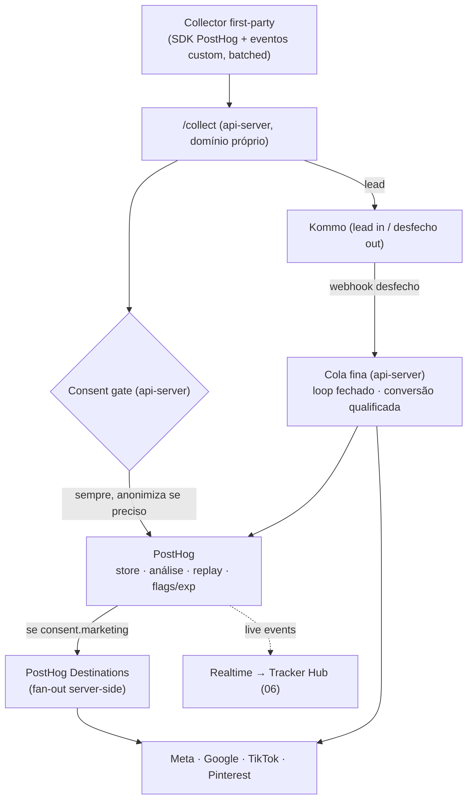

# 05 · Spec — Event HUB & Mensuração

**Status:** v2 (D-3 fechado: PostHog + cola fina) · **Camada de tom:** trabalho · **Depende de:** 02 (Fundação), 03 (Arquitetura)
**Responsabilidade única:** a espinha de captura, persistência e distribuição de eventos — incluindo **modo de teste, realtime e saúde de integração** — e o painel interno de mensuração. O 06 (Tracker Hub) **opera** estas capacidades, não as redefine.

> **Decisão fechada (00 §6):** o pipeline **não é construído — é composto**: **PostHog** = captura, store, análise, replay, flags/experimentos **e fan-out a plataformas de mídia via Destinations**. O que é nosso é a **cola fina no api-server**: endpoint `/collect`, integração bidirecional com Kommo, **loop fechado** de conversão qualificada e consent gate. O catálogo de Destinations deve ser confirmado na implementação; canal sem conector nativo entra por webhook → api-server → API do canal.

---

## 1. Princípios

1. **First-party.** Captura por domínio próprio (ex.: `t.valeverdefestas.com.br`). Resiliência a ad-blocker, cookies longevos.
2. **Server-side nos destinos.** Conversões via APIs server-side; pixel client-side só como complemento com dedupe.
3. **Contrato único.** Um schema canônico (§4). Todo destino mapeia a partir dele. Nova plataforma = novo **adapter**.
4. **Consentimento é gate** (§6). Build diferido; gancho ativo.
5. **Não bloquear a página.** Captura assíncrona/batched; nunca degrada CWV.
6. **Loop fechado** (§9). O desfecho do Kommo retorna e alimenta os canais pagos.
7. **Teste nunca contamina produção** (§11). Eventos de teste são segregados de ponta a ponta.
8. **Compor, não construir.** PostHog cobre o commodity; código próprio só na cola que nenhuma plataforma entrega (Kommo, loop fechado, consent na nossa regra).

---

## 2. Arquitetura do HUB



---

## 3. Collector (client SDK)

Captura sem bloquear render:
- `page_view`, `route_change`, `page_enter`/`page_exit`, tempo na página
- `scroll_depth` (25/50/75/100%)
- `cta_click` e cliques rastreáveis (heatmap-lite)
- `form_start`, `form_field`, `form_submit`, `lead`, `whatsapp_handoff`
- `experiment_exposure`

Características: **batched**, `navigator.sendBeacon`, `event_id` por evento (dedupe), `anonymous_id`/`session_id` em cookie first-party, carregamento deferido.

---

## 4. Schema canônico de evento (o contrato)

Vocabulário pós-rename (02): `subjects[]` + `objective`, **nunca** `venue`.

```json
{
  "event_id": "uuid-v4",
  "event_name": "scroll_depth",
  "timestamp_client": "2026-06-10T14:03:11.221Z",
  "anonymous_id": "first-party-id",
  "session_id": "session-id",
  "brand": "VVF",
  "test": false,
  "consent": { "analytics": true, "marketing": false },
  "context": {
    "url": "https://valeverdefestas.com.br/lp/...",
    "referrer": "...",
    "utm": { "source": "", "medium": "", "campaign": "", "content": "" },
    "xcode": "CP-...",
    "correlation_id": "reservado (join key — value-mapping diferido)",
    "lp": { "id": "", "molde": "", "variant": "a" },
    "subjects": [ { "ref": "acqua", "type": "espaço" } ],
    "objective": "handoff_whatsapp",
    "experiment": { "key": "", "variant": "" }
  },
  "params": { "depth_pct": 75 }
}
```

Campo `test` (§11): quando `true`, o evento atravessa todo o pipeline mas é roteado para endpoints de teste/sandbox e **excluído** do store de produção. Regra: adicionar destino = escrever `Destino.map(event)`. O evento é definido **uma vez**.

---

## 5. Intake & enrich

1. **Intake:** recebe lotes no endpoint first-party, valida schema, responde rápido (não espera terceiros).
2. **Enrich:** timestamp de servidor, IP→geo, parse de user-agent, stitching de sessão, **hash de PII** para Advanced/Enhanced Matching.

---

## 6. Consent gate (gancho LGPD — build diferido)

- Eventos de **marketing** só seguem se `consent.marketing = true`.
- **Analytics interno** persiste sempre, anonimizado/agregado sob interesse legítimo, respeitando opt-out.
- Hoje **pass-through** (sem efeito) até o build de LGPD (D-5). Campo e passo já existem.

---

## 7. Event Store (decidido: PostHog Cloud)

O PostHog **Cloud** (com captura first-party via proxy pelo domínio próprio; região a definir no setup, com olho na LGPD) é o store e a camada de análise. Self-host fica como **fallback documentado** caso o build de LGPD (D-5) exija dado em casa — o contrato de evento (§4) é idêntico nos dois, então a troca não é rebuild — funis, replay, heatmap, flags/experimentos prontos. O painel executivo (§12) e o Tracker Hub (06) consomem via API/embed. Eventos `test:true` ficam em namespace/projeto segregado.

---

## 8. Destinos (fan-out)

**Default: PostHog Destinations** faz o envio server-side aos canais de mídia. **Fallback** para canal sem conector: webhook PostHog → api-server → API do canal (um `map(event)` puro + testes). Kommo e a conversão qualificada do loop fechado são sempre da cola fina (api-server).

| Destino | Caminho default | Complemento client (dedupe) | Endpoint de teste (§11) |
|---|---|---|---|
| Meta | Destinations → Conversions API | Pixel | Test Events (`test_event_code`) |
| Google | Destinations → GA4/Ads (ou fallback) | Google Tag | Validation/Debug |
| TikTok | Destinations → Events API (ou fallback) | Pixel | `test_event_code` |
| Pinterest | Destinations/fallback → Conversions API | Tag | modo teste |
| **Kommo** | cola fina: API (lead in) + webhook (desfecho out) | — | pipeline/lead de teste |
| WhatsApp | via Kommo (D-6) | — | sandbox |

---

## 9. Loop fechado (Kommo → HUB → mídia)

1. Kommo emite desfecho — `Ganho` / `Perdido` + motivo / `Pipeline Recuperável` — via webhook à cola fina (api-server).
2. A cola grava no PostHog (painel) **e** dispara conversão qualificada aos canais pagos (CAPI/offline conversions), casando por `event_id`/telefone/`correlation_id`.
3. Sem isso, Meta/Google otimizam por clique/preenchimento, não por lead qualificado.
4. **Dedup do loop (D-11):** `lead_qualificado`/`ganho` disparam **por card** (idempotência pela identidade do card no Kommo), nunca por interação — evita reportar conversão duplicada e inflar o CPA artificialmente.

Eventos adicionais ao catálogo: `lead_qualificado`, `ganho`, `perdido` (origem: Kommo).

### 9.1 Ingestão de lead forms nativos (D-13)

Leads gerados **dentro das plataformas** (Meta Instant Forms/Lead Ads, TikTok Lead Generation, Google Lead Form assets, Pinterest Lead Ads) nunca tocam o site. Caminho: webhook da plataforma → api-server (cola fina) → normalização para o contrato de lead (04 §7, com `origin_channel` da plataforma e metadados do formulário) → **dedup D-11** (telefone E.164, upsert-e-anexar) → card no Kommo. Consequências: (a) o loop fechado cobre esses leads sem trabalho extra (dispara por card); (b) a atribuição os enxerga (campanha/form id no lugar do xcode de página); (c) campanhas de lead form viram formato utilizável sem furo de funil. Evento `lead` correspondente é emitido ao PostHog para o painel.

### 9.2 Sync de audiências (D-13)

Capacidade da cola fina (ou Destinations, onde houver conector): exportar **segmentos do funil** — ex.: cards `Ganho`, `lead_qualificado`, visitantes de alta intenção — como **custom audiences** (Meta Customer List, Google Customer Match, TikTok Audiences) com PII **hasheada**. É o que semeia lookalikes de alta qualidade, a prática nº 1 dos playbooks do segmento. Respeita o consent gate (D-5) quando ativo; sync é incremental e idempotente.

---

## 10. Confiabilidade

- **Fila/retries**: no caminho Destinations, a entrega/retry é do PostHog; na cola fina (Kommo, loop fechado, fallbacks), fila própria com **idempotência** por `event_id`, retries com backoff e **dead-letter** (exposto na saúde — §11).
- **Dedupe** pixel↔server por `event_id`.
- Observabilidade do HUB e da fila; rate-limit no endpoint de coleta (`/collect` é público por design — D-12; proteção é rate-limit + validação de schema + WAF, não auth).

---

## 11. Modo de teste, realtime e saúde de integração

As três capacidades que o **Tracker Hub do 06** opera. Definidas aqui (donas do pipeline), operadas lá (console).

**11.1 Modo de teste / validação de integração.** O HUB aceita eventos `test:true` (sintéticos, disparados do Tracker Hub). Eles atravessam o pipeline real (intake → enrich → adapters) mas:
- vão para os **endpoints de teste/sandbox** de cada destino (§8) — nunca para produção;
- ficam em **namespace segregado** no store; não entram em métricas, funis nem otimização de mídia;
- retornam um **resultado de round-trip por destino** (aceito/rejeitado + payload + resposta), para validar uma integração de ponta a ponta antes de confiar nela.

**11.2 Realtime tap.** Stream ao vivo dos eventos no intake (tail), assinável por filtro (tipo, sessão, Assunto, LP, `test`). É o que alimenta o inspetor de eventos do Tracker Hub.

**11.3 Saúde de integração.** Por destino: taxa de sucesso/erro de dispatch, latência, profundidade de fila, itens em retry e em dead-letter, timestamp da última sincronização. Permite ver "Meta está aceitando? Kommo respondeu?" em um olhar.

**11.4 Replay/depuração.** Reenviar um `event_id` específico (idempotente) para depurar um destino. Ação sensível → restrita a Admin (06 §6).

---

## 12. Painel de mensuração interno

Lê do store, **agregando por `type` de Assunto e por Assunto** (ambos dados — não quebra quando o portfólio muda):
- Scroll & engajamento por LP/página.
- Click maps / heatmap-lite.
- Fluxo de navegação: entrada → saída, caminhos, bounce.
- **Funil M-04**: LP → form_start → lead/handoff → (visita → venda, do Kommo).
- Conversão por variante (+ significância — detalhe no 08).
- Atribuição por canal/UTM (lead **qualificado**, não só clique).
- Session replay (se Opção A), PII mascarada, respeitando consentimento.

---

## 13. Catálogo de eventos canônicos

`page_view` · `route_change` · `page_enter` · `page_exit` · `scroll_depth` · `cta_click` · `whatsapp_handoff` · `form_start` · `form_field` · `form_submit` · `lead` · `experiment_exposure` · `lead_qualificado` · `ganho` · `perdido`.

---

## 14. Decisões & diferidos (fonte: 00 §6)

- **D-3** — **fechado: PostHog** (incl. Destinations). Catálogo de conectores a confirmar na implementação; fallback definido (§8).
- **D-5** (LGPD) — diferido; consent gate como pass-through.
- **Join key** — `correlation_id` reservado; value-mapping diferido.

---

## 15. Validação contra invariantes VVF

- **Tom:** spec = trabalho ✓
- **INV-08 (sem surpresas, operação):** fila + idempotência + retries + dead-letter + modo de teste = mensuração estável e verificável ✓
- **Performance:** captura assíncrona/batched, server-side nos destinos ✓
- **Agnosticidade:** contrato único + adapters; store e plataforma plugáveis ✓
- **Cornerstone #3 (transparência):** consent gate de primeira classe; teste segregado de dados reais ✓
