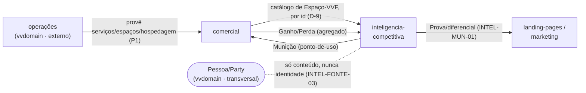

# Domain Map — Vale Verde (VVLEADHUB)

> ⚠️ Ownership e edições deste mapa: **só via `doc-domain-architect`** (ARQUITETURA-IA §6.1).
> Última atualização: 2026-06-21 · **Origem:** WO-INTEL-001 passo C (1º Domain Map do repo) · **Tom:** trabalho
>
> Este documento é um **ÍNDICE DE NAVEGAÇÃO**, não uma camada de doc.
> Regras de negócio → o Business Doc de cada domínio. Implementação → o System Doc.
> O mapa carrega só **nomes, ownership e relações** — nunca recopia regra (golden rule: o que vive nos dois lados, drifta).

---

## §0 — Contextos (fronteira de repo)

O mapa cobre os domínios de negócio **deste repo (vvleadhub)**; entidades cuja fonte canônica é outro contexto entram como **fronteira externa**, não se redefinem aqui.

- **vvleadhub (este repo)** — dois domínios: **comercial** (vende) e **inteligencia-competitiva** (observa). É um bounded context **distinto** do vvdomain ([`business/README.md`](business/README.md)).
- **vvdomain (externo, não mapeado aqui)** — a **operação** (buffet/estoque/decoração/…: cria, veta e opera os serviços, espaços e hospedagem) **e** a camada **Pessoa/Organização (Party)**. Aparecem abaixo como **fonte canônica externa** / Conceito Transversal — o vvleadhub **consome/representa**, não possui.

---

## §1 — Domínios

| # | Domínio | Categoria | Propósito (1 frase) | Business Doc | System Doc |
|---|---------|-----------|---------------------|--------------|------------|
| 1 | **comercial** | Funcional (venda) | Vende a experiência VVF: empacota a oferta (Pacote/escada Essential→Inspiração→Autoral), conduz o funil e registra Ganho/Perda. **Não cria o que vende.** | [`business/comercial/`](business/comercial/_dominio.md) | — (desdobra em [`specs/plataforma/`](specs/plataforma/); system não consolidado) |
| 2 | **inteligencia-competitiva** | Funcional | Observa, registra e sintetiza o que os concorrentes fazem (radar) e arma o comercial (munição). | [`business/inteligencia-competitiva/`](business/inteligencia-competitiva/_dominio.md) | — pendente (passo F) |
| — | **operações** | Externo (vvdomain) | Cria/vet a/opera serviços, espaços e hospedagem (gate de viabilidade/processo interno). | vvdomain (não mapeado aqui) | — |

---

## §2 — Princípios arquiteturais

Princípios cross-domain capturados nesta camada (separados do ownership de entidade).

- **P1 — O comercial é domínio de VENDA, não de criação.** Tudo que a empresa **provê** (Serviço, Espaço, Hospedagem) **nasce e é vetado na operação** (análise de viabilidade, existência, processos internos) — o comercial **só empacota e comercializa** o que é disponibilizado. O que o comercial **possui** é a construção da venda: Pacote/oferta, funil, Ganho/Perda. *(Decisão do fundador, jun/2026 — registrada como [D-25](_decisoes.md).)*
- **P2 — Handoff Auditável: não se aplica neste mapa (ainda).** Os fluxos cross-domain hoje são referência de catálogo + feedback agregado, sem transferência de responsabilidade contábil (ver §5). O padrão surge quando domínios operacionais com débito contábil (ex.: Buffet↔Estoque, no vvdomain) forem mapeados — ou se o comercial passar a **escrever de volta** em artefatos da inteligência (ver §7).

---

## §3 — Entidades e Ownership

**Fonte canônica** = onde a entidade nasce / quem tem autoridade sobre a definição. **Representação/Consumo** = a visão que outro domínio tem dela (atributos podem diferir — é esperado).

### §3.1 — Construções de venda (nascem no comercial)

| Entidade | Fonte canônica | Consumido por | Nota |
|----------|----------------|---------------|------|
| **Pacote** (Essential · Inspiração · Autoral) | comercial | — | a oferta empacotada; é o ato de venda, por isso é do comercial |
| **Tipo de Evento** (Casamento núcleo · Aniversário · Debutante · Corporativo) | comercial | — | classificação da oferta (`business/comercial/_dominio.md` §3.1) |
| **Funil de venda** (SDR/Closer) | comercial *(não mapeado — B1)* | — | **Missing Stub** — o processo de venda ainda não é Business Doc |
| **Ganho/Perda** | comercial *(funil — stub)* | inteligencia-competitiva (agregado, por conexão) | **[L2]** dono = comercial (DR5 / INTEL-ANL-02); definição hoje **reside nos docs de intel** → ver Reconciliação §6 |

### §3.2 — Provido pela operação (vvdomain) · o comercial representa e vende

| Entidade | Fonte canônica | Representação/Consumo | Nota |
|----------|----------------|-----------------------|------|
| **Serviço** (Buffet · Decoração · Cerimonial · Planejamento · Som & Iluminação · Bartender · Entretenimento/DJ · …) | **operações (vvdomain)** | comercial: item vendável no Pacote (`papel: padrão\|adicional`) | **P1** — comercial não cria serviço; representação de venda |
| **Espaço-VVF** (Acqua · Florest · Serra · Morada · Villa) | **operações (vvdomain)** | comercial: catálogo de venda (record no payload, render no site) · inteligência: **referência na Disputa por id** (D-9) | sempre qualificar **"Espaço-VVF"** (≠ Concorrente-Espaço) |
| **Hospedagem** (Morada · Villa) | **operações (vvdomain)** | comercial: produto ortogonal vendável | **P1** — provido pela operação |

### §3.3 — Núcleo da inteligência (Anel 1 — coleta · Anel 2 — análise/munição)

| Entidade | Fonte canônica | Consumido por | Nota |
|----------|----------------|---------------|------|
| **Grupo** | inteligencia-competitiva | — | ciclo `ativo → absorvido/arquivado` (lado-Grupo do re-parentamento) |
| **Concorrente-Espaço** *(raiz observada)* | inteligencia-competitiva | — | re-parentamento sem perder identidade (INTEL-COL-03) |
| **Canal** (procedência) | inteligencia-competitiva | — | toda Observação aponta para um Canal + um Concorrente-Espaço |
| **Observação** *(átomo do radar)* | inteligencia-competitiva | síntese | **[L3]** captura datada — resiste à refutação |
| **Estética** | inteligencia-competitiva | — | eixo N:N |
| **Disputa** *(associativa N:N)* | inteligencia-competitiva | — | referencia **Espaço-VVF** por id (D-9); eixo central do radar (INTEL-COL-11) |
| **Finding** *(síntese curada)* | inteligencia-competitiva | consumidores estratégicos | **[L3]** — resiste |
| **Pergunta de Inteligência** | inteligencia-competitiva | — | **dois ciclos**: pontual (terminal) × monitoramento contínuo (não-terminal); baseline do radar é independente dela (INTEL-ANL-01) |
| **Objeção→Argumento** *(Munição)* | inteligencia-competitiva | comercial (ponto-de-uso, INTEL-MUN-04) | aprovação dono-único = fundador (INTEL-MUN-03) |
| **Prova** | inteligencia-competitiva | comercial · landing-pages (só prova citável-ao-casal, INTEL-MUN-01) | distinguir citável × inteligência-interna |
| **Battlecard** | inteligencia-competitiva | comercial | ancora no nível da **Disputa** |

### §3.4 — Saídas derivadas da inteligência *(NÃO são entidades primárias — INTEL-ANL-03)*

Computadas/sintetizadas a partir do núcleo; sem dono próprio de entidade, sem cravar persistência aqui (decisão de materialização é da spec, passo E):

- **SWOT** (a Fraqueza é o quadrante W, não saída irmã) · **Reputação** (agregado de reviews) · **Mapa de posicionamento** (view de eixos) · **Delta / "o que mudou"** (computado, **não persistido** — se preciso registrar, o artefato é o Finding do ciclo).

---

## §4 — Relações entre domínios

| De | Tipo | Para | O que flui |
|----|------|------|-----------|
| operações (vvdomain) | Publica→Consome | comercial | serviços/espaços/hospedagem disponibilizados (comercial vende, **não cria** — P1) |
| comercial | **Referência de Catálogo por id** (D-9, sem FK cross-schema) | inteligência | Espaço-VVF (a Disputa referencia o record do catálogo) |
| comercial *(funil)* | Publica→Consome | inteligência | Ganho/Perda (o **agregado**; intel consome por conexão) |
| inteligência | Publica→Consome | comercial *(funil)* | Munição no ponto-de-uso (INTEL-MUN-04) |
| inteligência | Publica→Consome | landing-pages/marketing | só Prova/diferencial (INTEL-MUN-01) |

> **Por que intel↔comercial NÃO é Partnership/Coordena:** o acoplamento é por **DADO** (catálogo/evento), não por **MODELO** — cada lado é dono do seu artefato (Munição = intel; Ganho/Perda = comercial), nenhum modelo compartilhado muda junto. São **dois Publica→Consome opostos**, não um par sincronizado.

---

## §5 — Conceitos transversais

| Conceito | Definição canônica | Notas |
|----------|--------------------|-------|
| **Pessoa/Organização (Party)** | **provável: vvdomain (em mapeamento)** | Casal · Fornecedor · Assessoria/Wedding Planner · Influenciador · vendedor-do-rival · autor-de-review. **Não cristalizar aqui.** A inteligência guarda **conteúdo-de-negócio, nunca identidade** (INTEL-FONTE-03) — vendedor-do-rival/autor-de-review **jamais** viram registro de identidade no intel. Gatilho de uso real: quando **≥2 domínios persistirem identidade** (ex.: o funil cadastra o Casal como cliente). |
| **Status** (gestão de estado) | status registry (spec — `doc-specs-mapper`, **passo E**) | Ciclos a alinhar: Concorrente-Espaço (`candidato→ativo→dormente→arquivado`), Grupo (`ativo→absorvido/arquivado`), Finding (`rascunho→curado→obsoleto`), Objeção→Argumento (`rascunho→publicada→em revisão/aposentada`), Pergunta de Inteligência (**dois ciclos**). |

---

## §6 — Reconciliação *(itens a aplicar quando a fonte amadurecer — `doc-reconciler`)*

| # | Item | Situação | Disparo |
|---|------|----------|---------|
| **R1** | **Ganho/Perda** | Dono = comercial (DR5/INTEL-ANL-02), mas a **definição reside hoje nos docs de intel** ([`analise.md`](business/inteligencia-competitiva/analise.md) §1.3) — o comercial-funil ainda não tem Business Doc | quando o **funil comercial (B1)** for mapeado: revisitar para o intel não ficar dono-sombra |
| **R2** | **Serviço · Espaço-VVF · Hospedagem** | Apresentados como entidades em [`business/comercial/_dominio.md`](business/comercial/_dominio.md), mas a fonte canônica é **operações (vvdomain)** — no comercial são **representação de venda** (P1) | quando os domínios de **operação (vvdomain)** forem mapeados: clarificar no comercial que são representações |

---

## §7 — Lacunas

- **Missing Stubs (referenciados, sem Business Doc):** **operações** (vvdomain — externo, dono de Serviço/Espaço/Hospedagem); **funil comercial** (SDR/Closer — B1 adiado); **Pessoa/Party** (vvdomain, em mapeamento).
- **Seam de subdivisão futura:** dentro da inteligência, **Coleta** (anel 1) × **Munição** (enablement) podem virar dois domínios quando a munição **descongelar** (D-19) e ganhar volume — **não** subdividir no v1 (abstração prematura sobre fatia congelada).
- **Vigiar (P2):** se no B1 o comercial passar a **escrever de volta** em artefatos do intel (ex.: marcar uma Objeção→Argumento como "usada/funcionou"), nasce um handoff bidirecional que pede **Handoff Auditável** — hoje não existe.

---

## §8 — Notas para o pipeline (WO-INTEL-001)

- **Passo D — léxico (`doc-lexicon-keeper`):** fixar **"Espaço-VVF"** como canônico (vs **Concorrente-Espaço**, para o seed por id não errar o alvo); registrar **"Serviço"** com a nota de dois sentidos (entidade operacional × representação de venda); + os termos novos do intel (Grupo, Concorrente-Espaço, Observação, Finding, Estética, Disputa, Pergunta de Inteligência, Battlecard, Prova).
- **Passo E — specs (`doc-specs-mapper`):** a fonte de PK vem do ownership acima; a relação Disputa→Espaço-VVF é **por id** (D-9); decidir materialização/versionamento das saídas derivadas (§3.4) **sem** reabrir a classificação business; status registry resolve os ciclos de §5.
- **Decisão registrada (§2/P1):** a régua *"o comercial vende, não cria — o que a empresa provê é da operação"* foi formalizada como **[D-25](_decisoes.md)** (ADR em [`decisoes/D-25-comercial-vende-nao-cria.md`](decisoes/D-25-comercial-vende-nao-cria.md)), propagada por `sync-governanca` (WO-DOCS-002).
