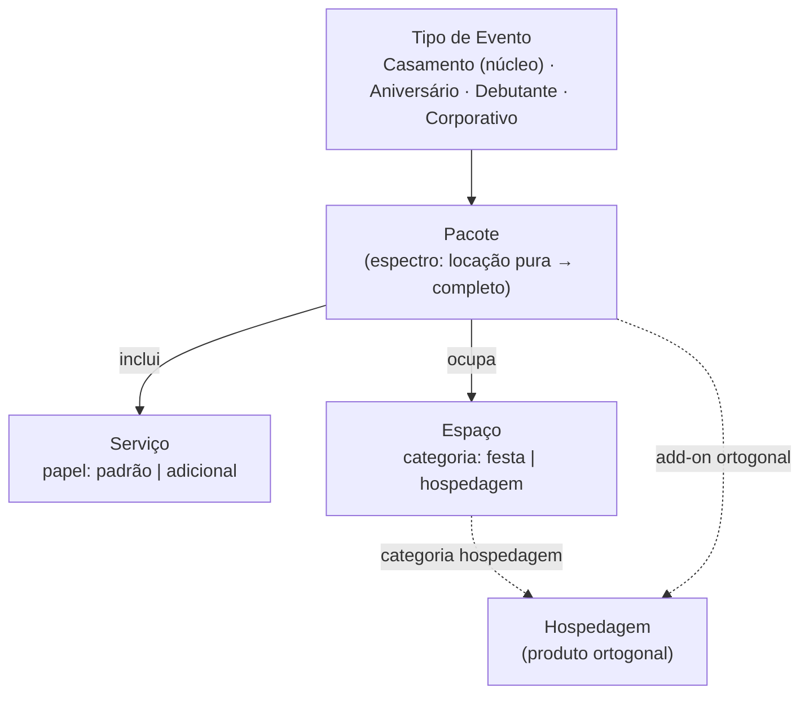

# Domínio Comercial — Modelo de Negócio

**Camada:** business · **Dominio:** comercial · **Origem:** 01-modelo-dominio.md · **Tom:** trabalho

> A verdade do negócio — entidades e atributos, tech-neutral. É a fonte do registro de Assuntos da plataforma (ver [`specs/plataforma/primitivas.md`](../../specs/plataforma/primitivas.md)) e do vocabulário de domínio (ver [`_lexico.md`](../../_lexico.md)).
>
> **Origem do conteúdo:** derivado da descrição direta do negócio pelo fundador (clean-room) e validado em ciclo de perguntas. Artefatos anteriores (CONTEXTO-IA, mapas de growth) entram só na nota de validação (§5).

---

## §1 — O negócio em uma linha

Empresa de **casamentos premium** no interior paulista, vendendo **pacotes completos de evento** (a quase totalidade das vendas) em espaços próprios, com hospedagem como produto ortogonal.

---

## §2 — A camada estrutural (validada)

**`Tipo de Evento` ▸ realizado via `Pacote` ▸ composto de `Serviços` ▸ sediado em `Espaço`.**

Na linguagem da metodologia interna, é uma **camada estrutural cross-domain (Type B)** acima dos domínios de serviço individuais (Buffet, Decoração, Cerimonial, …). Registrada como input para um futuro Domain Map.

---

## §3 — Entidades

### §3.1 — `Tipo de Evento` — registro ativo

A natureza da celebração. **Todos vendáveis hoje**, tratados igualmente pelo modelo; Casamento é o núcleo comercial (~totalidade das vendas).

Instâncias: **Casamento** · **Aniversário** · **Debutante** · **Corporativo** *(outros, raríssimos, entram por dado)*.

**Decisão (validada):** a "verticalização" (VVXV/VVCorp — arquitetura de marca em CONTEXTO-IA §6) é conceito **organizacional** (equipe/processos dedicados, futuro, atrás de gate). Comercialmente, qualquer tipo de evento é vendável desde já — o registro é ativo, não reservado.

### §3.2 — `Espaço`

Local físico. Atributo **`categoria: festa | hospedagem`** (validado — cobre os 5):

- `festa`: **Acqua**, **Florest**, **Serra**
- `hospedagem`: **Morada do Vale**, **Villa do Vale**

Atributos de conteúdo (para a plataforma): galeria, vídeo-tour, localização, capacidade, descrição.

### §3.3 — `Pacote`

O que se vende. Espectro: **locação pura** (extremamente rara) → **pacote completo** (quase totalidade), com serviços padrão + adicionais opcionais.

**Escada de produto (CONTEXTO-IA §3.4, INV-07):** o pacote materializa a escada **Essential → Inspiração → Autoral**:

- **Essential** — pacote base, padronizado (serviços padrão).
- **Inspiração** — upgrade **rotineiro** sobre o Essential (decoração adicional, bar, itens extras de buffet, cardápio mais elaborado). Pré-configurado para simplificar a venda do upgrade; é a expressão prática de exclusividade percebida sem perder padrão operacional. O caminho default de venda é **Essential → Inspiração**.
- **Autoral** — **é o nível máximo da escada**: customização **total**, sob medida, **esporádica**, precificada **caso a caso** e fora da matriz de ticket. É a exceção a que se refere INV-07 (customização total é exceção, não norma) — pode inclusive ser trabalhada como campanha de marketing, mas continua sendo um nível de produto, não um formato fora da estrutura. Liberação avaliada por projeto (gate G-03 em CONTEXTO-IA §8).

**Hospedagem** é produto singular e **ortogonal** aos níveis (ver §3.5), normalmente fechado já na assinatura do contrato.

### §3.4 — `Serviço`

Componente entregue dentro do pacote. Atributo **`papel: padrão | adicional`** (terminologia validada; valores extensíveis por dado se surgir categoria real):

- `padrão` (compõe o pacote): **Assessoria Cerimonial do Dia**, **Planejamento do Evento**, **Buffet**, **Decoração**, **Som e Iluminação**
- `adicional` (opcional): **Bartender**, **Cerveja**, **Chope**, **Entretenimento** (painel de LED, kombi fotográfica, …)

**Decisão (validada):** `papel` é atributo **do Serviço** (papel típico). A relação Pacote×Serviço não é modelada na plataforma — Pacote é estrutura de oferta do domínio, não entidade do site. Finalidade do `papel` na plataforma: ângulo de copy ("já incluído e excelente" vs. "eleve a experiência") e etiquetagem de interesse que conversa com o KPI de upgrade (M-02 em CONTEXTO-IA §7) — a medição do upgrade em si acontece no comercial/Kommo.

**Nota de ownership:** serviços como Buffet/Decoração coincidem com domínios do negócio; o domínio é o dono canônico, o `Serviço` aqui é sua representação na camada de composição/venda.

### §3.5 — `Hospedagem`

Produto ligado aos Espaços de categoria `hospedagem`. **Ortogonal** ao espectro do pacote — add-on/produto à parte, normalmente fechado na assinatura do contrato (CONTEXTO-IA §3.4).

---

## §4 — Mapeamento para o registro de Assuntos

Como Espaço, Serviço e campanhas viram **Assunto / TipoDeAssunto** na plataforma — e o que **não** vira (Pacote, Tipo de Evento) — está modelado em [`specs/plataforma/primitivas.md`](../../specs/plataforma/primitivas.md). Este domínio é a fonte das instâncias; a spec carrega a tabela de mapeamento e a regra de promoção a TipoDeAssunto.

---

## §5 — Validação contra invariantes (nota)

Verificação do modelo contra o canon de negócio (invariantes em CONTEXTO-IA §2):

- **INV-07** — customização total como exceção: refletido na escada Essential → Inspiração → Autoral, com Autoral esporádico e precificado caso a caso ✓
- **INV-03** — serviços são componentes da experiência completa; o domínio não posiciona componente isolado ✓
- **Foco não se dilui (CONTEXTO-IA §6):** verticais seguem organizacionais e atrás de gate; o registro ativo de Tipo de Evento não antecipa vertical ✓

**Reconciliação com o CONTEXTO-IA (resolvida):**

| Este domínio | CONTEXTO-IA | Resolução |
|---|---|---|
| `padrão` + `adicionais` | Essential → Inspiração (§3.4) | correspondem: padrão ≙ Essential · +adicionais ≙ Inspiração ✓ |
| Autoral = nível máximo da escada de Pacote | Autoral como nível esporádico, customização total (§3.4 / §10 / INV-07) | **alinhado ao CONTEXTO-IA:** Autoral é o topo da escada (Essential → Inspiração → Autoral), exceção precificada caso a caso — pode ser trabalhado como campanha, sem deixar de ser nível de produto ✓ |
| Tipo de Evento ativo (todos vendáveis) | VVXV/VVCorp atrás de gate (§6) | compatível: gate é organizacional (equipe/processos/voz própria); venda avulsa é permitida hoje ✓ |
| Hospedagem ortogonal | idem (§3.4) | consistente ✓ |

> As lacunas conhecidas do domínio (ciclo de vida, regras numeradas, atores, ownership fino) estão registradas em [`lacunas.md`](lacunas.md).
