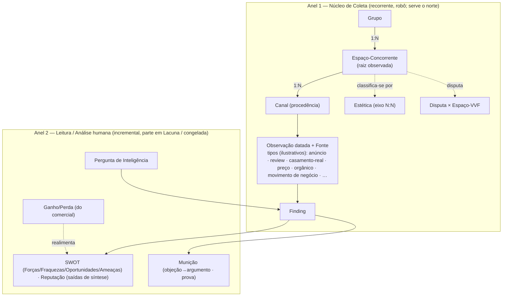
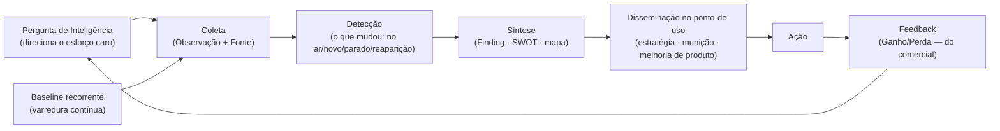

# Domínio Inteligência-Competitiva — Modelo de Negócio

**Camada:** business · **Dominio:** inteligencia-competitiva · **Origem:** WO-INTEL-001 (passo B) · **Tom:** trabalho

> Status: **Rascunho v1 — precisa de validação** · Última atualização: 2026-06-20
>
> **Origem do conteúdo:** descrição direta do negócio pelo fundador (clean-room), validada em ciclo de perguntas, enriquecida por (a) uma varredura de mercado externa (disciplina de inteligência competitiva, battlecards de venda, mercado de casamento premium no Brasil, monitoramento competitivo) trazida **só como candidatos**, e (b) uma análise adversarial multi-agente cujos achados foram confrontados contra os **dados já coletados** do radar v0 ([`docs/discovery/radar/`](../../discovery/radar/)). Os registros de discovery são exploratórios (§6.4 da Arquitetura) — informam, mas a verdade validada é esta camada business. Decisões de coordenação e modelagem batidas com o fundador (jun/2026).

---

## §1 — O domínio em uma linha

A função que dá à VVF uma **leitura intencional do mercado** — observar, registrar e sintetizar o que os concorrentes fazem, de forma **recorrente e de fácil acesso** — para **antecipar** movimentos, **armar o comercial** e **retroalimentar as operações internas**. É a diferença entre enxergar e ser cego: o cego é funcional, mas quem enxerga se antecipa e ganha agilidade.

---

## §2 — Tipo de domínio e fronteiras

**Funcional** — tem processo e cadência próprios (o ciclo de inteligência), não é só um papel. A unidade observada central é o **Espaço-Concorrente** (ver §3 e [`coleta.md`](coleta.md)).

- **É:** a captura curada e recorrente de inteligência sobre concorrentes (radar); a síntese dessa inteligência em leitura acionável (análise/estratégia); a munição que arma a venda (enablement).
- **Não é:** o funil comercial (domínio comercial); o registro de Espaços/produtos da VVF (domínio comercial); a camada de identidade de pessoas (cross-domain — ver [`lacunas.md`](lacunas.md)).

**Escopo curado-agora × motor congelado (D-19/D-20).** Mapeia-se **todo** o domínio aqui (mapear é liberado). O que se **constrói agora** é só o **núcleo curável** — registro manual no admin + seed (D-20). O **motor de coleta automatizada** (os robôs) e a detecção de mudança ao longo do tempo seguem **congelados atrás do gate** (D-19): descritos como destino do domínio, **não** construídos. "Anúncio entra no ar / para / volta", "longevo = vencedor", "o que mudou desde o último ciclo" são **verdade de negócio** mapeada — sem virar máquina de estados, fórmula ou limiar no corpo (isso é da spec).

---

## §3 — A arquitetura em dois anéis

O domínio se organiza em **dois anéis de centralidade** (peso diferente, unidos pelo ciclo de inteligência), e **não** em três facetas de peso igual — o peso igual achataria a espinha de coleta no mesmo nível da periferia humana, exatamente a super-projeção que o norte do negócio proíbe.

- **Anel 1 — Núcleo de Coleta** (a espinha): Grupo, Espaço-Concorrente, Canal, Observação, Estética, Disputa, Finding. Detalhe em [`coleta.md`](coleta.md).
- **Anel 2 — Leitura / Análise humana**: Pergunta de Inteligência, SWOT (inclui a célula Fraqueza) / Reputação (saídas de síntese), Ganho/Perda (conexão com o comercial), Mapa de posicionamento — em [`analise.md`](analise.md); e a Munição — em [`municao.md`](municao.md).

---

## §4 — Atores

Papéis (responsabilidades), não cargos — um papel é cumprido por **humano e/ou agente de IA**; quem executa é detalhe.

**Quem opera o domínio hoje**

| Papel | Responsabilidade | Decide sobre | Executor hoje |
|---|---|---|---|
| **Curador / Decisor** | define as perguntas, classifica, aprova o que entra no registro canônico e a munição | o que é canônico | **Fundador** |
| **Coleta + Síntese** | varre as superfícies, captura observações datadas + cliente oculto, transforma bruto em Finding, detecta o que mudou | — | Agente(s) de IA |

> Papéis finos de coleta (coletor / sintetizador / triador especializados) **se especializam quando volume e time justificarem** — registrado como Lacuna, não modelado como organograma fictício no v1.

**Quem consome**

| Consumidor | Uso |
|---|---|
| **Estratégico** | fundador, diretoria e **áreas internas** (ex.: buffet) — antecipação, posicionamento, melhoria de produto/operação |
| **Comercial** | Closers, SDRs, Coordenação e Gerência/Diretoria comercial — munição no **ponto-de-uso** da venda |
| **Criador** | marketing/growth — gera assets (LP, criativo) a partir da inteligência, respeitando a fronteira munição→copy (`INTEL-MUN-01`) |

**Aprovação da munição:** **dono único = o fundador**, em dois níveis (ver `INTEL-MUN-03`).

**Ecossistema observado** (atores que o domínio observa, mas que **não o operam** — cross-domain, para o Domain Map): Casal · Assessoria/Wedding Planner (filtra/controla a indicação) · Fornecedor · Marketplace/portal · Influenciador/editorial · Organizador de feira.

---

## §5 — Princípios e invariantes (a cerca do domínio)

Regras de marca e de coleta que valem em **todo** o domínio. As regras por anel vivem nos arquivos de cada faceta.

### §5.1 — Marca (aplicação direta das invariantes)

- `INTEL-GERAL-01` (Restrição): a inteligência serve estratégia **intencional** (a marca cria espaço); NUNCA justifica me-too, cópia ou caça-tendência (INV-01). Toda saída de Análise/Munição herda essa cerca **na redação**, não só na intenção.
- `INTEL-GERAL-02` (Restrição): observa-se o concorrente como **experiência integrada**; uma força só é defesa válida quando escala a um diferencial (CONTEXTO-IA §9) / "sem surpresas"; PROIBIDO comparar **componente isolado** (INV-03).
- `INTEL-GERAL-03` (Restrição): preço e condições do rival são **inteligência interna de 1ª classe**; NUNCA viram preço/desconto como argumento em **copy público** (INV-05). Saber o preço = sim; comunicar por preço = não.

### §5.2 — Coleta legítima (D-24)

- `INTEL-FONTE-01` (Política): a coleta admite conteúdo **público OU não-público** — cliente oculto/*mystery shopping* no escopo (preço real, script de venda, processo, pontos fracos do atendimento).
- `INTEL-FONTE-02` (Restrição): SOMENTE por **meios legítimos** — sem ato ilícito, invasão ou quebra de NDA.
- `INTEL-FONTE-03` (Restrição): **minimização de PII** (dados pessoais identificáveis) — guarda-se o *conteúdo de negócio* da Observação (nota, sentimento, verbatim sobre o serviço, fonte, data), NUNCA a identidade do indivíduo (autor de review, casal, vendedor). O alvo é a inteligência **de negócio** do concorrente.
- `INTEL-FONTE-04` (Restrição): NUNCA reusar criativo alheio nos nossos anúncios (copyright).
- `INTEL-FONTE-05` (Política): toda Observação carrega **Fonte + confiabilidade**; a confiabilidade herda da fonte (público < inferido-de-anúncio < cliente-oculto).

---

## §6 — Fluxo: o ciclo de inteligência

O **baseline recorrente não depende de pergunta prévia** (`INTEL-ANL-01`): o radar varre o núcleo continuamente. A **Pergunta de Inteligência** existe para direcionar o **esforço caro** (cliente oculto, perfil profundo), não para autorizar a coleta de rotina.

---

## §7 — Conexões com outros domínios *(stub para o `doc-domain-architect`)*

| Domínio | O que flui | Direção | Nota |
|---|---|---|---|
| comercial (funil / SDR-Closer) | munição consumida no ponto-de-uso ↔ Ganho/Perda + intel de campo | ↔ | **dono do Ganho/Perda = comercial**; fronteira fina e superfície de consumo ao Domain Map (B1 adiado) |
| comercial (registro de Espaço VVF) | a **Disputa** liga ao registro de Espaço/categoria da VVF | → | por identidade; mecânica fica na spec (D-9) |
| landing-pages / plataforma | afiar LP/campanha a partir do rival | → | handoff recorrente p/ `nova-lp`, **só via Prova/diferencial** (`INTEL-MUN-01`) |
| marketing/growth + operações internas | inteligência → assets (Criador) + melhoria de produto (ex.: buffet) | → | consumidores estratégicos |
| camada Pessoa/Party | vendedor do rival, autor de review, casal | — | **Lacuna ALTA** — não modelar aqui; a regra é `INTEL-FONTE-03` (guardar o conteúdo de negócio, não a pessoa) |

---

## §8 — Glossário

- **Grupo** *(também Operador)* — a entidade econômica (a dona): faz aporte, define playbook, agrega sub-marcas. Pode ter N Espaços-Concorrentes.
- **Espaço-Concorrente** — a **unidade observada** que disputa um casal por estética, nível de mercado e tema (ex.: um espaço específico). É a raiz da faceta Coleta.
- **Relação competitiva** {direto, indireto} e **nível de mercado** (a faixa; ex.: premium-full · premium-partial · mid · below, *extensível por dado*) — os dois eixos ortogonais que classificam um Espaço-Concorrente (substituem o antigo "tier" guarda-chuva). "Aspiracional" não é nível.
- **Canal** — a *procedência*: a superfície onde se observa um Espaço-Concorrente (perfil social, ficha de marketplace, fonte de review, biblioteca de anúncios, site, feira — ilustrativos, extensíveis por dado).
- **Observação** — uma captura **datada** de um estado/fato de um Espaço-Concorrente, com Fonte e confiabilidade. Tem **tipos** ilustrativos e extensíveis por dado (anúncio, review, casamento-real, preço, orgânico, movimento de negócio…), não entidades separadas.
- **Finding** *(síntese curada e legível)* — interpretação curada ("o que isto significa") que cita as Observações de origem. *(Síntese, sem maiúscula, nomeia a etapa/atividade do ciclo, não a entidade.)*
- **SWOT** (Forças, Fraquezas, Oportunidades, Ameaças) — consolidado derivado da síntese; a **Fraqueza** é o componente W do SWOT, **não** um conceito irmão (nutrido sobretudo pelo negativo de reviews + cliente oculto).
- **Reputação** — saída de síntese: agregado derivado das Observações de review.
- **Estética** — eixo de classificação do Espaço-Concorrente (rústico, clássico, boho…); um rival pode ter mais de uma.
- **Disputa** — a relação "este Espaço-Concorrente compete com tal Espaço/categoria da VVF".
- **Pergunta de Inteligência** — a pergunta de negócio que direciona o esforço caro de coleta (equivale ao *Key Intelligence Topic*, KIT).
- **Munição** — a inteligência empacotada para o comercial usar na venda (objeção típica → argumento de defesa).
- **Battlecard** — resumo curado VVF vs. rival que agrega a munição no nível da Disputa.
- **Prova** — evidência reutilizável (case, depoimento, número) que sustenta um diferencial.
- **PII** — dados pessoais identificáveis (autor de review, casal, vendedor).

> **Termos no léxico** (`_lexico.md`): Grupo, Espaço-Concorrente, Observação, Finding, Estética, Disputa, Pergunta de Inteligência, Battlecard, e os rótulos dos eixos (nível de mercado, movimento de negócio) — **fixados no passo D** (WO-INTEL-001, jun/2026). O antigo `Concorrente-Espaço` foi renomeado para `Espaço-Concorrente` (`doc-reconciler`).

---

## §9 — Convenção de IDs e contagem de regras

IDs no padrão **`INTEL-<FACETA>-NN`**, prefixados por faceta para evitar colisão quando as regras crescerem:

| Faceta | Prefixo | Onde |
|---|---|---|
| Marca (invariantes) | `INTEL-GERAL-` | este arquivo, §5.1 |
| Coleta legítima | `INTEL-FONTE-` | este arquivo, §5.2 |
| Núcleo de Coleta | `INTEL-COL-` | [`coleta.md`](coleta.md) |
| Análise / Estratégia | `INTEL-ANL-` | [`analise.md`](analise.md) |
| Munição / Enablement | `INTEL-MUN-` | [`municao.md`](municao.md) |

**Total de regras: 29** — GERAL (3) · FONTE (5) · COL (11) · ANL (4) · MUN (6).

---

## §10 — Lacunas e decisões futuras

Registradas em [`lacunas.md`](lacunas.md) (companheiro deste âncora).
