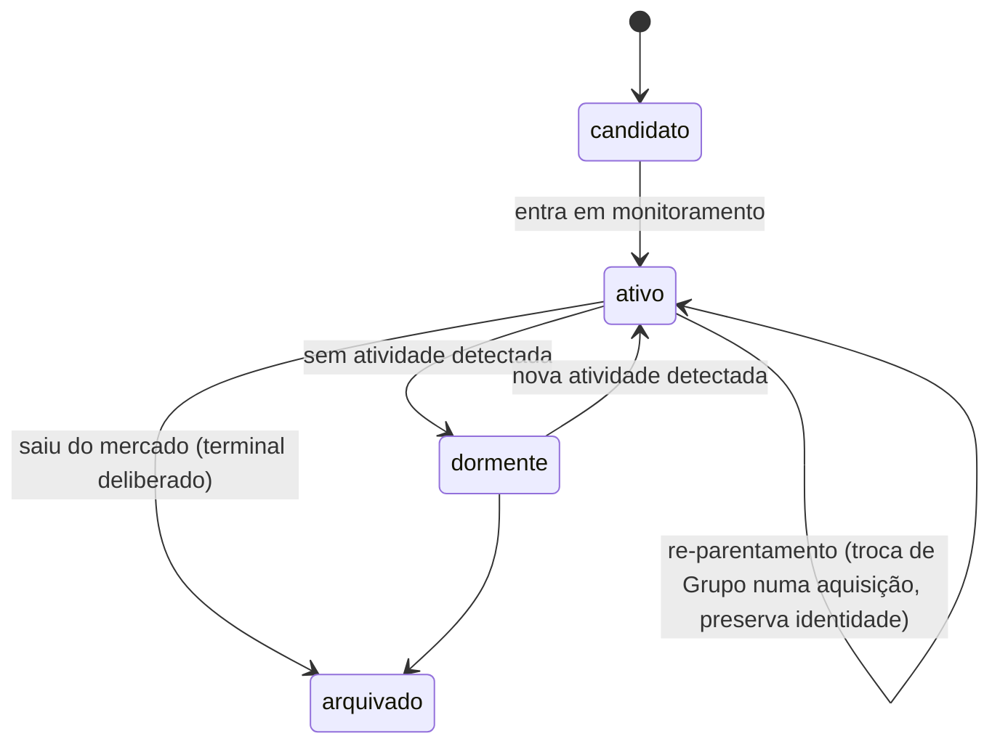

# Inteligência-Competitiva — Anel 1: Núcleo de Coleta (Radar)

**Camada:** business · **Dominio:** inteligencia-competitiva · **Origem:** WO-INTEL-001 (passo B) · **Tom:** trabalho

> Pré-requisito de leitura: [`_dominio.md`](_dominio.md) (visão geral, fronteiras, atores, cerca de marca/coleta). Este arquivo detalha a **espinha** do domínio — o que o robô coleta de forma recorrente para entregar o norte (inteligência recorrente, de fácil acesso).

---

## §1 — Entidades

### §1.1 — `Grupo`
**O que é:** a entidade econômica — a **dona** (também chamada *Operador*). É quem faz aporte, define o playbook de mídia e agrega sub-marcas.
**Atributos essenciais (núcleo):** nome, identidade.
**Cardinalidade:** Grupo (1) : Espaço-Concorrente (N) — o caso "grupo de um só espaço" é coberto naturalmente (todo Espaço-Concorrente pertence a um Grupo, mesmo unitário), então o modelo aceita tanto o **grupo consolidado** (vários Espaços-Concorrentes) quanto o **espaço único** (grupo unitário).
**Ciclo de vida:** `ativo → absorvido/arquivado` (numa aquisição, o grupo de origem pode ir a "absorvido").
**Fora do núcleo (Lacuna):** atributos econômicos ricos — aporte, playbook de mídia (centralizado × por-espaço), sub-marcas de serviço que atendem terceiros — **não** se cravam agora; firmam-se com a coleta (ver [`lacunas.md`](lacunas.md)).

### §1.2 — `Espaço-Concorrente` *(raiz observada)*

> *Nota-forward (re-root jun/2026):* no v1 **venue-only**, o Espaço-Concorrente é a raiz observada do radar — e **assim permanece** neste Business Doc. A generalização para **Operador de mercado** (conceito transversal, do qual o Espaço-Concorrente é o **recorte** `tipo ⊇ {espaço} ∧ relação ⊇ {concorrente}`) vive no [`_domain-map.md §5`](../../_domain-map.md) e em [`lacunas.md`](lacunas.md) (L10/DR6); **não** se modela aqui (Arquitetura §6.4).

**O que é:** a unidade que **disputa um casal** por estética, nível de mercado e tema. É o nível que de fato compete; é nele que moram estética, nível de mercado e os ponteiros de observação.
**Atributos essenciais (núcleo — o que o robô precisa para apontar):** nome; apelido(s) anterior(es); as **superfícies onde se observa** (perfis, ficha de marketplace, presença em biblioteca de anúncios, site); o Grupo a que pertence.
**Perfil estratégico (cresce com a curadoria, não bloqueia o núcleo):** capacidade, modelo de pacote, hospedagem on-site, rede de fornecedores, anos de operação, posicionamento de preço *(inteligência interna)*. Parte por pesquisa de fontes públicas (desk-research), parte por cliente oculto (D-24).
**Ciclo de vida:**

### §1.3 — `Canal`
**O que é:** a **procedência** — a superfície onde se observa um Espaço-Concorrente.
**Subtipos (ilustrativos, extensíveis por dado):** social · ficha-de-marketplace · fonte-de-review · biblioteca-de-anúncios · site · feira (offline) · …
**Cardinalidade:** Espaço-Concorrente (1) : Canal (N). Toda Observação aponta para um Canal (a procedência) e para um Espaço-Concorrente (o dono).

### §1.4 — `Observação`
**O que é:** a **captura datada** de um estado ou fato de um Espaço-Concorrente, com Fonte e confiabilidade. É o átomo do radar — **uma** entidade, não cinco quase-sinônimas.
**Tipos** (ilustrativos, não entidades separadas; a taxonomia fina estabiliza com o uso — ver [`lacunas.md`](lacunas.md))**:** anúncio · review · casamento-real (portfólio) · preço (oferta) · conteúdo orgânico · movimento de negócio (expansão, contratação, nova parceria) · …
**Pertinência:** Observação → Espaço-Concorrente (N:1) e Observação → Canal (N:1).
**Atributos essenciais:** o que foi capturado; **quando-se-viu** × **quando-aconteceu**; **primeira-vez-visto** / **última-vez-visto** (para detectar "parou"); Fonte + confiabilidade.
**Bruto × interpretação:** a captura bruta é registrada e fica **separada** da interpretação curada (o Finding), que cita a Observação de origem.

Notas por tipo:
- **anúncio** — a **longevidade** (quanto tempo fica no ar) é proxy de "vencedor" — anúncio que persiste sinaliza oferta que funciona.
- **review** — fonte assimétrica: a nota média é índice de superfície; o **valor está no negativo** (o verbatim sobre o serviço alimenta a célula Fraqueza — o quadrante W do SWOT, *Forças/Fraquezas/Oportunidades/Ameaças* — que sustenta a munição). Guarda-se o **conteúdo de negócio** + o **autor/origem** (contato-origem de visibilidade interna, para prospecção — `INTEL-FONTE-03` emendada), nunca divulgado.
- **casamento-real** — **sinal agregado** (contagem/estética/data como proxy de volume de eventos), sem identificar o casal.
- **preço** — Observação datada com procedência e confiabilidade herdada da fonte (não atributo fixo); é inteligência interna (`INTEL-GERAL-03`), conecta à métrica de ticket (M-02).

### §1.5 — `Estética`
**O que é:** eixo de classificação de 1ª classe do Espaço-Concorrente (rústico, clássico, boho, garden, romântico…).
**Cardinalidade:** N:N — um Espaço-Concorrente pode ter mais de uma estética (e a mesma estética cobre vários rivais).

### §1.6 — `Disputa`
**O que é:** a relação associativa "este Espaço-Concorrente compete com tal **Espaço/categoria da VVF**". É o eixo central do radar — o cruzamento **estética × nível de mercado × Espaço-VVF disputado** é o mais usado.
**Cardinalidade:** N:N (um rival pode bater mais de um Espaço da VVF; um Espaço da VVF é disputado por vários rivais). A ligação ao registro de Espaço da VVF é **por identidade** — a mecânica fica na spec (D-9).

### §1.7 — `Finding`
**O que é:** a interpretação curada e **legível** ("o que isto significa") — é ela que entrega o "fácil acesso" do norte. Cita as Observações de origem. *(Síntese, sem maiúscula, é a etapa/atividade do ciclo, não a entidade.)*
**Ciclo de vida:** `rascunho → curado/publicado → obsoleto`.

---

## §2 — Saídas derivadas (não são entidades)

- **Delta / "o que mudou"** — resultado de comparar o ciclo atual com o anterior: **no ar / novo / parado / reaparição**. É computado, não persistido como entidade; se for preciso registrar "o que mudou", o artefato é o Finding do ciclo.
- **Reputação** — agregado derivado das Observações de review.
- **Mapa de posicionamento** — visão derivada (rivais em eixos) — vive na faceta Análise ([`analise.md`](analise.md)).

---

## §3 — Regras de negócio (`INTEL-COL-`)

- `INTEL-COL-01` (Restrição): a coleta bruta é registrada e **separada** da interpretação; o Finding cita a(s) Observação(ões) de origem.
- `INTEL-COL-02` (Política): a entidade-raiz observada é o **Espaço-Concorrente**; o **Grupo** é o agregador econômico. Cardinalidade Grupo (1) : Espaço-Concorrente (N), com o grupo de um só espaço coberto.
- `INTEL-COL-03` (Restrição): um Espaço-Concorrente pertence a **um** Grupo e pode **trocar de Grupo** numa aquisição **sem perder a identidade** longitudinal (re-parentamento); o Grupo de origem pode ir a "absorvido/arquivado".
- `INTEL-COL-04` (Restrição): toda Observação pertence a **um** Espaço-Concorrente e tem **um** Canal de procedência.
- `INTEL-COL-05` (Política): a **Estética** é um eixo de classificação (um Espaço-Concorrente pode ter mais de uma); a **classificação competitiva** tem dois eixos ortogonais — a **relação competitiva** {direto, indireto} (fechado) e o **nível de mercado** (a faixa; ilustrado por premium-full / premium-partial / mid / below, *extensível por dado*). *("Aspiracional" não é nível — convida ao me-too, atrita com `INTEL-GERAL-01`.)*
- `INTEL-COL-06` (Temporal): **"parou" é detectado pela ausência** num ciclo (última-vez-visto anterior ao ciclo atual), não por um sinal de entrada; a **reaparição** exige confirmação antes de contar como religamento, para separar o religamento genuíno do furo de coleta.
- `INTEL-COL-07` (Heurística): distinguir **quando-se-viu** de **quando-aconteceu** — "novo" pode ser só novo-para-o-radar (o fato pode anteceder a existência do radar).
- `INTEL-COL-08` (Heurística): a **longevidade** de um anúncio (tempo no ar) é proxy de "vencedor"; as faixas exatas se calibram com o dado (Lacuna).
- `INTEL-COL-09` (Política): a **cadência** casa com a velocidade do tipo de Observação — tipos rápidos (preço, anúncio) observados com mais frequência que tipos lentos (expansão, contratação); os intervalos exatos se calibram com o uso.
- `INTEL-COL-10` (Política): o **núcleo** de atributos do Espaço-Concorrente é identidade + as superfícies onde se observa (o que o robô precisa para apontar); o **perfil estratégico** (capacidade, pacote, fornecedores, anos, preço, SWOT) cresce com a curadoria e **não bloqueia** o núcleo.
- `INTEL-COL-11` (Restrição): cada Espaço-Concorrente associa-se a **≥1 Espaço/categoria da VVF** disputado (a Disputa) — o cruzamento estética × nível de mercado × Espaço-VVF é o eixo central do radar.
