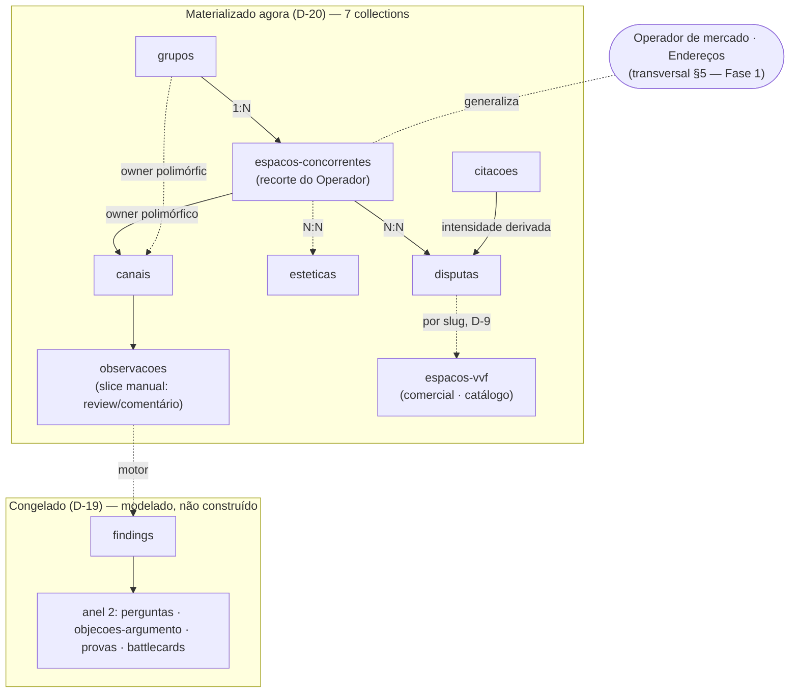

# Inteligência-Competitiva — visão de domínio

**Camada:** system · **Domínio:** inteligência-competitiva · **Origem:** [`specs/inteligencia/`](../specs/inteligencia/) (5 specs) + [`_domain-map.md`](../_domain-map.md) + [`business/inteligencia-competitiva/`](../business/inteligencia-competitiva/_dominio.md); D-19/D-20/D-9/D-25/D-26 · **Tom:** trabalho

A função que dá à VVF uma **leitura intencional do mercado** — observar, registrar e sintetizar o que os concorrentes fazem de forma **recorrente e de fácil acesso**, para antecipar movimentos, armar o comercial e retroalimentar a operação. Este System Doc **compõe** as specs venue-only do passo E num todo coeso e descreve as fronteiras; o **detalhe** (campos, FKs, enums, estados) mora nas specs linkadas — aqui é coesão, não recópia.

> **Enquadramento de duas altitudes (re-root jun/2026).** A entidade observada é o **recorte venue-only** de um conceito transversal mais amplo, o **Operador de mercado** ([`_domain-map.md §5`](../_domain-map.md)). O que **se constrói no v1** é o recorte (`tipo ⊇ {espaço} ∧ relação ⊇ {concorrente}`) — as 7 collections deste domínio. O `operadores-de-mercado` completo + o banco de **Endereços** agnóstico são **modelados-não-construídos** (§6 abaixo). O System Doc **linka** o conceito; quem o define é o Domain Map, e modelar a Curadoria/Assessoria atrás dele é Fase 1 (Arquitetura §6.4).

---

## §1 — Princípios (invariantes técnicas do domínio)

Cada um aponta para a spec dona — não se reabre aqui.

- **Isolamento D-9.** Tudo no schema `payload`; nenhuma FK atravessa schema; a referência cross-domain é **por id/slug**, validada na aplicação. → [`modelo-de-dados.md §1`](../specs/inteligencia/modelo-de-dados.md) · [`arquitetura.md §5`](arquitetura.md).
- **Bruto separado da interpretação.** A `Observação` (átomo datado) é **append-only**; a síntese (`Finding`) cita as Observações de origem, não as sobrescreve. → [`status-registry.md §3`](../specs/inteligencia/status-registry.md) · [`modelo-de-dados.md §3.6`](../specs/inteligencia/modelo-de-dados.md) (SYS-INTEL-05).
- **Confiabilidade é derivada, não digitada.** Deriva de `fonte` (enum ordinal `publico < inferido_de_anuncio < cliente_oculto`). → [`guardrails-coleta.md §4`](../specs/inteligencia/guardrails-coleta.md) (SYS-INTEL-04).
- **Identidade de quem originou = visibilidade interna.** `contato_origem` guarda origem + contato para validação/prospecção e **nunca** aflora em superfície pública (INTEL-FONTE-03 emendada; LGPD diferida com gancho). → [`guardrails-coleta.md §3`](../specs/inteligencia/guardrails-coleta.md).
- **Saída derivada não é atributo primário.** SWOT/Reputação/Mapa/Delta são produtos da análise — **não viram colunas** no Espaço-Concorrente. → [`saidas-derivadas.md §1`](../specs/inteligencia/saidas-derivadas.md) (INTEL-ANL-03).
- **Cerca de marca na borda de saída.** Nada adversarial/me-too/preço-do-rival cruza para copy público — guard de fronteira intel→landing/comercial (a construir quando a munição descongelar). → [`guardrails-coleta.md §1`](../specs/inteligencia/guardrails-coleta.md) (INTEL-GERAL-01/02/03 → INV-01/03/05).

---

## §2 — Arquitetura / topologia

O núcleo materializado (Anel 1, venue-only) e a extensão congelada (motor + Anel 2):

Detalhe de cada caixa nas specs (§4); a **partição de build** (o que é construído × congelado) está em §7.

---

## §3 — Como as peças (specs) compõem o domínio

O índice navegável — uma linha por spec, o que ela resolve no todo:

| Spec | O que resolve no todo |
|---|---|
| [`modelo-de-dados.md`](../specs/inteligencia/modelo-de-dados.md) | as 7 collections materializadas (grupos · espacos-concorrentes · canais · esteticas · disputas · observacoes · citacoes), campos, FKs e a partição materializado×congelado. É a espinha; as demais specs penduram nela. |
| [`status-registry.md`](../specs/inteligencia/status-registry.md) | os namespaces `intel.<entidade>`, estados e transições válidas; declara explícitos os **sem-ciclo** (observacoes/citacoes append-only). 1ª status registry do repo. |
| [`seed-bootstrap.md`](../specs/inteligencia/seed-bootstrap.md) | o contrato do seed portável — chave natural por entidade, idempotência (2× sem duplicar), ordem de carga (resolve FKs) e a migração do radar v0 → banco. |
| [`guardrails-coleta.md`](../specs/inteligencia/guardrails-coleta.md) | traduz `INTEL-GERAL`/`INTEL-FONTE` em pontos de imposição (PII/visibilidade, fonte→confiabilidade, cerca de marca de saída). É o critério de aceite "guardrails escritos na spec". |
| [`saidas-derivadas.md`](../specs/inteligencia/saidas-derivadas.md) | materialização × computação de SWOT/Reputação/Mapa/Delta/intensidade — quase tudo congelado; o Mapa e a intensidade já são computáveis sobre o registro curado. |

---

## §4 — Fronteiras com outros domínios

Descritas a partir do [`_domain-map.md §4`](../_domain-map.md) (ownership é lei do Map; aqui só a relação + o link da spec que materializa o seam).

| Vizinho | Relação (DDD) | O que cruza | Materialização |
|---|---|---|---|
| **comercial** (catálogo Espaço-VVF) | Publica→Consome (referência de catálogo, D-9) | a **Disputa** aponta para o Espaço-VVF **por `espacos.slug`** — sem FK cross-schema, validado na aplicação | [`modelo-de-dados.md §3.5/§4`](../specs/inteligencia/modelo-de-dados.md) (SYS-INTEL-03) |
| **comercial** (funil — B1) | Publica→Consome (oposto) | **Ganho/Perda** (agregado, dono = comercial, DR5) e o sinal de **Citação** (pesquisa de preço → intensidade da Disputa) | [`modelo-de-dados.md §3.7`](../specs/inteligencia/modelo-de-dados.md) (SYS-INTEL-07; handoff bidirecional a firmar no B1) |
| **comercial** (ponto-de-uso) | Publica→Consome | **Munição** no ponto-de-uso da venda (INTEL-MUN-04) | **congelado** (anel 2, D-19) |
| **landing-pages / marketing** | Publica→Consome | só **Prova/diferencial** citável (INTEL-MUN-01) — a cerca de marca de §1 governa a borda | **congelado** |
| **Pessoa/Party** (transversal) | — | só **conteúdo de negócio, nunca identidade**; o intel guarda `contato_origem` leve de visibilidade interna | [`guardrails-coleta.md §3`](../specs/inteligencia/guardrails-coleta.md) (INTEL-FONTE-03) |
| **Operador de mercado · Endereços** (transversal §5) | — (futuro) | serão consumidos por **curadoria + parceria** na Fase 1; hoje existe **só o recorte intel** | [`_domain-map.md §5/§7`](../_domain-map.md) — modelado-não-construído (§6) |

---

## §5 — O ciclo de inteligência (fluxo)

A composição runtime das peças, do baseline à ação (detalhe de negócio em [`_dominio.md §6`](../business/inteligencia-competitiva/_dominio.md)):

`Pergunta de Inteligência` (direciona o esforço caro) **+** baseline recorrente → **Coleta** (`observacoes` + `fonte`) → **Detecção** (Delta: no ar/novo/parado/reaparição — computado, [`saidas-derivadas.md §2`](../specs/inteligencia/saidas-derivadas.md)) → **Síntese** (`findings`, SWOT, Mapa) → **Disseminação** no ponto-de-uso (estratégia · munição) → **Ação** → **Feedback** (Ganho/Perda do comercial) → volta à Pergunta. O **baseline não depende de pergunta prévia** (INTEL-ANL-01). No v1 só a **Coleta manual** (slice review/comentário) e o **Mapa/intensidade** computáveis estão de pé; Detecção-motor e Síntese curada são congeladas (§6/§7).

---

## §6 — Recorte modelado-não-construído (destino do domínio)

Espelha [`modelo-de-dados.md §6`](../specs/inteligencia/modelo-de-dados.md) e [`saidas-derivadas.md`](../specs/inteligencia/saidas-derivadas.md) — descrito para o todo fechar e para o motor descongelar **sem reabrir negócio**:

- **Motor de `observacoes`** — tipos automatizados (anúncio→longevidade, preço, casamento-real, orgânico, movimento-de-negócio), jobs Apify/Meta Ad Library/YouTube no `api-server`, time-series Anúncio/Sinal, detecção de Delta. *(D-19)*
- **`findings`** + **Anel 2** (`perguntas-de-inteligencia`, `objecoes-argumento`, `provas`, `battlecards`) — síntese curada e munição, ancoradas na Disputa, consumidas no ponto-de-uso. *(D-19 munição)*
- **Saídas derivadas** (SWOT/Reputação/Delta) congeladas; **Mapa** e **intensidade da Disputa** já computáveis sobre o registro curado (render L3 congelado).
- **Generalização (re-root):** o `operadores-de-mercado` completo (eixos `tipo_de_servico[]` × `relacao_com_vvf[]`, ambos multi) e o **banco de Endereços agnóstico** (L11) são o **destino transversal** — build é Fase 1, precedido por discovery+business da **Curadoria** e pelo **funil B1**. Ver [`_domain-map.md §5/§7`](../_domain-map.md) e [`lacunas.md L10/L11/DR6`](../business/inteligencia-competitiva/lacunas.md).

---

## §7 — Partição de build (a cerca do passo G)

A WO-INTEL-001 §G constrói **só** a partição materializada; o resto é §6. Fonte: [`modelo-de-dados.md §2`](../specs/inteligencia/modelo-de-dados.md).

| Partição | Collections | Build |
|---|---|---|
| **Materializado agora** (D-20) | `grupos` · `espacos-concorrentes` · `canais` · `esteticas` · `disputas` · `observacoes` (slice mínimo) · `citacoes` | passo G |
| **Congelado** (D-19) | motor de `observacoes`, `findings`, Anel 2; saídas derivadas (exceto Mapa/intensidade computáveis); `operadores-de-mercado` + Endereços (§6) | modelado, não construído |

---

## §8 — Decisões & diferidos

Agrega os IDs; o corpo vive no ledger ([`_decisoes.md`](../_decisoes.md)) e as lacunas em [`lacunas.md`](../business/inteligencia-competitiva/lacunas.md).

- **D-19** — vigília competitiva validada faseada (mapear liberado, build congelado atrás do gate de capacidade+evidência) + guardrails de coleta.
- **D-20** — descongela a **fatia casa-de-dados curada** (registro manual no admin + seed) — é o que o passo G constrói.
- **D-24** — cliente oculto/*mystery shopping* no escopo (`fonte=cliente_oculto`).
- **D-9** — isolamento de schema; Disputa→Espaço-VVF por slug.
- **D-25** — o comercial vende, não cria; o Espaço-VVF nasce na operação — a Disputa **aponta, não possui**.
- **D-26** — tese de curadoria/desintermediação: o motivador do re-root (Operador de mercado serve intel+curadoria+parceria).
- **Diferidos / lacunas:** DR1 (build faseado), DR6 (sequência da generalização), DR7 (citação→intensidade, handoff B1), L4/L5 (perfil econômico/sub-espaço), L6–L9 (taxonomias finas), L10/L11 (Operador/Endereços), R1/R2 (reconciliação Ganho-Perda/Serviço quando o B1/vvdomain forem mapeados).

---

## §9 — Validação contra invariantes VVF

Tom = **trabalho** (doc interno). A inteligência serve estratégia **intencional** — a marca cria espaço, não persegue tendência:

- **INV-01** (sem me-too): a saída de análise nunca justifica cópia/caça-tendência — `INTEL-GERAL-01`, imposto na borda de saída (§1).
- **INV-03** (experiência integrada): comparação só por experiência integrada, nunca componente isolado — `INTEL-GERAL-02`.
- **INV-05** (sem eixo de preço): preço do rival é inteligência interna de 1ª classe; **saber sim, comunicar por preço não** — `INTEL-GERAL-03`.
- **Coleta legítima** (INTEL-FONTE-01..05): meios legítimos, PII de visibilidade interna, base = público + legítimo interesse (D-19).

O registro curado **não emite copy** (a munição que emitiria é congelada) — a cerca de marca vira guard executável quando a munição descongelar; aqui a spec **crava a invariante**, o build a impõe.
