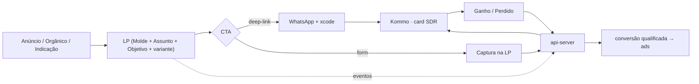

# Landing Pages & Conversão — visão de domínio

**Camada:** system · **Domínio:** landing-pages · **Origem:** 04-landing-pages.md · **Tom:** trabalho

**Responsabilidade única:** como LPs convertem — biblioteca de Blocos, caminho de conversão, contrato de lead → Kommo, propagação de origem e aplicação de marca. O **modelo** de LP (Molde/Assunto/Objetivo) é da plataforma ([`plataforma.md`](plataforma.md)); o A/B é da experimentação ([`experimentacao.md`](experimentacao.md)); o pipeline de eventos é de eventos ([`eventos.md`](eventos.md)); a edição é no admin ([`admin.md`](admin.md)).

> Este doc agrega e linka; o **detalhe** vive nas specs de `specs/landing-pages/`. Em conflito, a spec vence no que é detalhe; aqui mora a coesão do domínio e as fronteiras.

---

## §0 — TL;DR

A LP é um **tradutor de intenção**: pega a intenção do canal de origem e a converte num **card rastreado no Kommo**, geralmente via handoff WhatsApp a um SDR. A LP entrega o lead com origem; **conversa, cadência e qualificação são do Kommo**. Toda LP é uma derivação `Molde + Assunto(s) + Objetivo + Variante` (ver [`plataforma.md`](plataforma.md)) — nada de tipos de LP hardcoded. Catálogo de derivações vivas em [`../specs/landing-pages/derivacoes.md`](../specs/landing-pages/derivacoes.md).

---

## §1 — Papel no ecossistema

As duas pontas do CTA (deep-link / form), o speed-to-lead e a fronteira a partir do card estão em [`../specs/landing-pages/conversao-cta.md`](../specs/landing-pages/conversao-cta.md).

---

## §2 — Princípios

1. **LP traduz intenção, não vende componente** (INV-03): Assunto `serviço` é porta de entrada; o produto é a experiência completa.
2. **Mobile-first** — tráfego pago/Instagram é majoritariamente mobile.
3. **Conversão = card no Kommo.** Métrica é `lead`/handoff (idealmente `lead_qualificado` do loop fechado), nunca clique.
4. **Origem viaja sempre** — `xcode`/UTM da URL até o card (ver [`../specs/landing-pages/propagacao-origem.md`](../specs/landing-pages/propagacao-origem.md)).
5. **Block-based, editável no admin** — LP é dado. Biblioteca de Blocos em [`../specs/landing-pages/blocos.md`](../specs/landing-pages/blocos.md).
6. **Performance é gate** — orçamento de CWV (ver [`arquitetura.md`](arquitetura.md)) vale por LP; fora do orçamento, não publica. Indexação seletiva e canônico em [`../specs/landing-pages/seo-canonico.md`](../specs/landing-pages/seo-canonico.md).

---

## §3 — Contrato de lead

O JSON canônico do lead → Kommo, a captura fora do site e a regra de dedup (D-11) estão em [`../specs/landing-pages/contrato-lead.md`](../specs/landing-pages/contrato-lead.md) — materializado em `packages/contracts/src/lead.ts`. O desfecho (`Ganho`/`Perdido`) volta e alimenta o loop fechado de eventos ([`eventos.md`](eventos.md)).

---

## §10 — Marca na LP (resumo dos eixos)

A camada de marca é canônica no CONTEXTO-IA (entregue via `.agents/context/`; Claude Code importa pelo adapter `CLAUDE.md`) — aqui só o resumo dos eixos que toda LP respeita por construção, com os guardrails por Bloco em [`../specs/landing-pages/blocos.md`](../specs/landing-pages/blocos.md):

Sem preço (INV-05) · experiência integrada, nunca componente (INV-03) · exclusividade pela história, customização total só como campanha de exceção (INV-07) · confiabilidade de frente sem soar operacional (INV-04) · tranquilidade na jornada inteira (OP-03) · tokens visuais (CONTEXTO-IA §5), brand-locked no editor (ver [`admin.md`](admin.md)).

---

## §11 — Eventos emitidos

Reusa o catálogo canônico de eventos (ver [`eventos.md`](eventos.md)): `page_view` · `scroll_depth` · `cta_click` · `whatsapp_handoff` · `form_start` · `form_submit`/`lead` · `experiment_exposure`. A LP não define schema de evento próprio — o domínio de eventos é o dono.

---

## §12 — Validação contra invariantes VVF

- **Tom:** spec = trabalho ✓ · copy = marca com guardrails por Bloco ✓
- **INV-05/03/07/04 + OP-03:** aplicados por construção (Blocos + §10) ✓
- **INV-09:** derivações por dado, replicáveis ✓
- **M-04:** speed-to-lead + funil instrumentado ✓
- **Gates:** nada de vertical antecipada; `event_type` é dimensão, não vertical ✓
